# Build My First Xamarin App

## Estimated completion time: 60-75 minutes

In this lab, you will create a new cross-platform mobile application using the Xamarin tools for Visual Studio and Xamarin.Forms.

The app you will build is called **Minutes**; a tracking application which can be used to take notes during meetings, keep track of things assigned to you, or log your own personal thoughts.

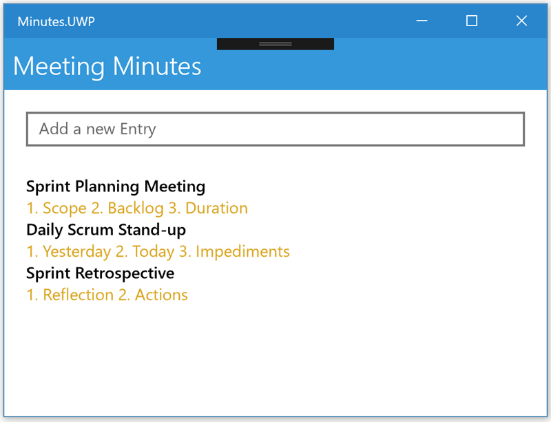

## Table of Contents

1. [Create solution](#1-create-solution)
2. [Explore the project](#2-explore-the-project)
3. [Run on Windows](#3-run-on-windows)
4. [Run on Android](#4-run-on-android)
5. [Run on iOS](#5-run-on-ios)
6. [Code the NoteEntry class](#6-code-the-noteentry-class)
7. [Add a storage interface](#7-add-a-storage-interface)
8. [Code the MemoryEntryStore class](#8-code-the-memoryentrystore-class)
9. [Build the list of notes in XAML](#9-build-the-list-of-notes-in-xaml)
10. [Improve the visualization for the notes](#10-use-a-better-visualization-for-the-notes)
11. [Add the edit screen](#11-add-the-edit-screen)
12. [Create a new note](#12-create-a-new-note)
13. [Delete a note](#13-delete-a-note)
14. [Add persistent storage](#14-add-persistent-storage)


## Prerequisites

This lab uses Visual Studio on Windows with the Xamarin mobile workload installed. It demonstrates projects for Windows, Android, and iOS. You can also use Visual Studio for Mac; however, this will only create projects targeting Android and iOS and a few of the steps might not match exactly.

> **Note** This lab assumes you are running Visual Studio 2017 on Windows 10 Fall Creators Update. If you are using an older version of Windows, you may not be able to run the UWP version of the application. In this case, you can skip those sections and deploy on iOS and/or Android.

## What you will learn
You will create a new Xamarin.Forms application and see how to construct a basic UI using XAML, connect the UI to behavior in C# code, and navigate between multiple screens, sharing the data between them.

## 1. Create solution
You will create a new Xamarin.Forms application using the Visual Studio 2017 *New Project* wizard. 

### Select template

1.  Launch Visual Studio.

2.  Navigate to **File > New > Project...**

3.  In the **New Project** window, navigate to the **Installed > Visual C# > Cross-Platform** section.

4.  Select the **Mobile App (Xamarin.Forms)** template.

5.  Enter **"Minutes"** in the **Name** field.

6.  Enter a folder in the **Location** field.

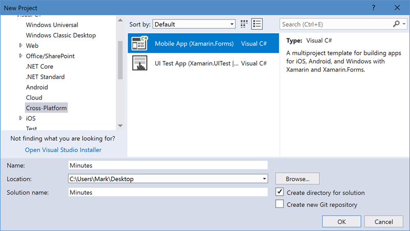

> **Note:** On Windows, it's recommended to use a location close to the root to avoid path-length issues.

7.  Click the **OK** button.


### Choose project options

1.  Select the **Blank App** template.

2.  Select the **Android**, **iOS**, and **Windows (UWP)** platforms.

3.  Select **.NET Standard** as the Code Sharing Strategy.

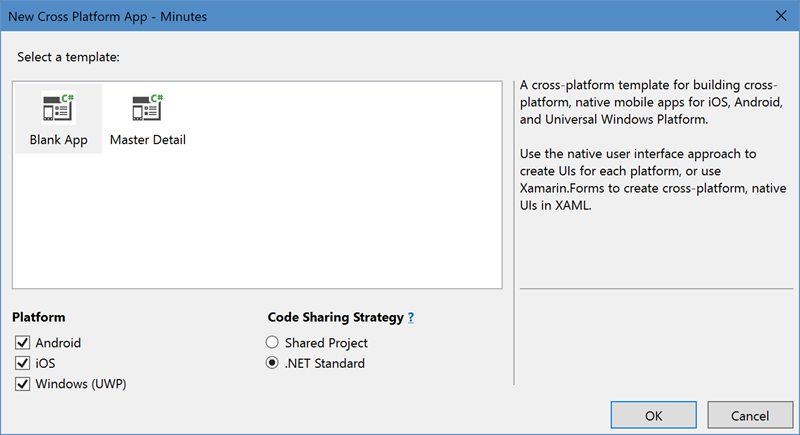

4.  Click the **OK** button to create the solution.

## 2. Explore the project

The wizard will create four projects: one for the shared code (as a .NET Standard library) and three for the platform-specific apps which can be run on the actual devices or simulator/emulators. 

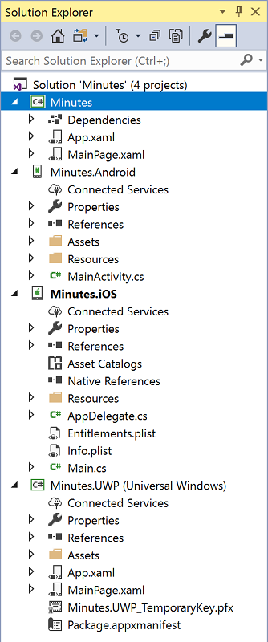

| Project     | Description |
|-------------|-------------|
| **Minutes** | The .NET Standard shared code project. This is shared between all the target platforms and is  where most of your code will go. |
| **Minutes.Android** | The Xamarin.Android project which generates the Android-specific binary package which can be deployed and run on Android devices. |
| **Minutes.iOS** | The Xamarin.iOS project which generated the iOS-specific binary package which can be run on iPhone and iPad devices. |
| **Minutes.UWP** | The Universal Windows project which can be run on Windows 10 devices. This project is only available when you create the solution with Visual Studio on Windows. |

## 3. Run on Windows

Execute the **Minutes.UWP** app on Windows. Make sure to select **Local Machine** so it runs locally vs. in a simulator. This will give you a much quicker deployment and startup time which is convenient during development and testing.

> **Note:** This requires Windows 10 Fall Creators Update.

### Set Startup Project

1.  In the **Solution Explorer**, locate the **Minutes.UWP (Universal Windows)** project.

2.  Right-click on the **Minutes.UWP (Universal Windows)** project.

3.  In the context menu, select **Set as StartUp Project**.

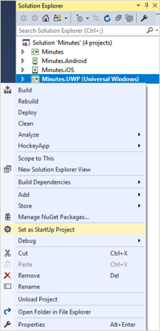

### Run the UWP app

1.  On the **Standard** toolbar, locate the **Debug Target** button.


2.  Verify that the text on the **Debug Target** button is **"Local Machine"**. If it is not, select the disclosure arrow on the side of the **Debug Target** button and choose **"Local Machine"** from the context menu.


3.  Click the **Debug Target** button to run the app.

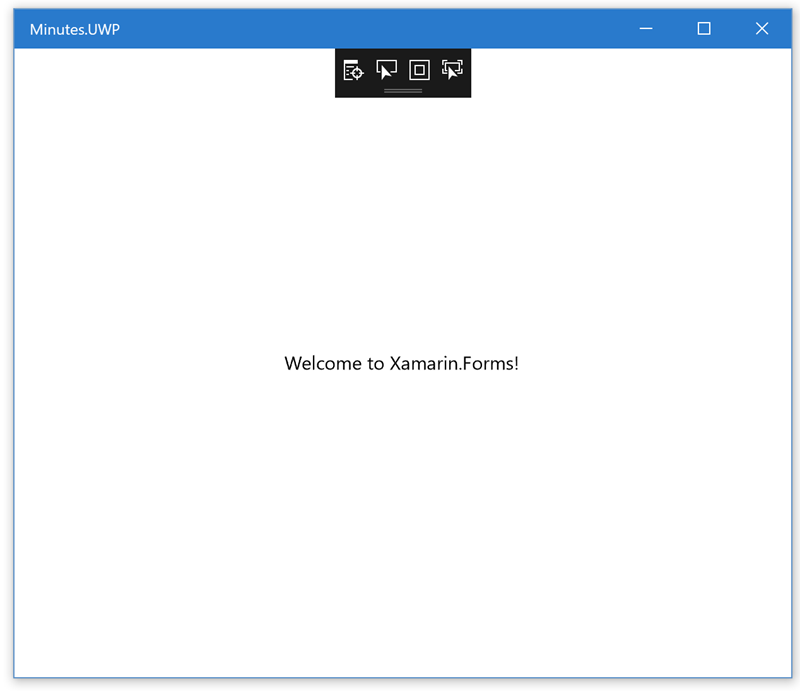

## 4. Run on Android

Execute the **Minutes.Android** app on an Android device or emulator. The instructions will show using an emulator, however, if a physical device is plugged in via USB, it should show up in the devices drop down as well.

### Set Startup Project

1.  In the **Solution Explorer**, locate the **Minutes.Android** project.

2.  Right-click on the **Minutes.Android** project.

3.  In the context menu, select the **Set as StartUp Project** entry.

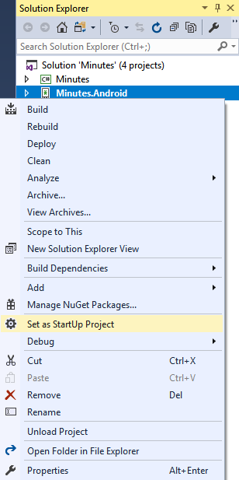

### Run the app

1.  On the **Standard** toolbar, locate the **Debug Target** button.

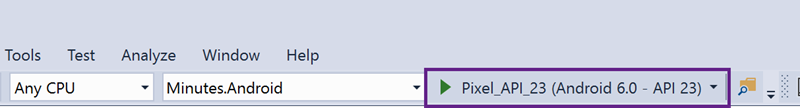

2.  Verify that the text on the **Debug Target** button is some version of an Android emulator. If it is not, select the disclosure arrow on the side of the **Debug Target** button and choose an Android emulator from the context menu.

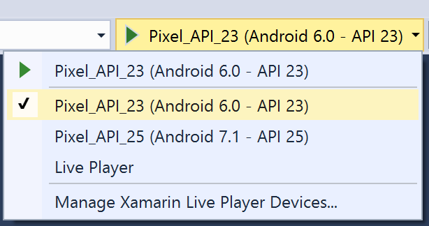

If you don't see any Android devices, you might need to do additional setup:

- [Set up the Android emulators in Visual Studio](https://docs.microsoft.com/en-us/xamarin/android/get-started/installation/android-emulator/)

- [Set up your Android Device for Development](https://docs.microsoft.com/en-us/xamarin/android/get-started/installation/set-up-device-for-development)

3.  Click the **Debug Target** button to run the app.

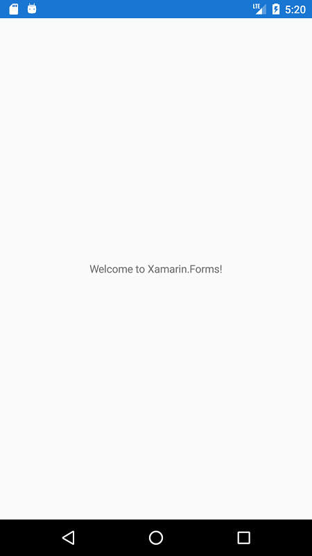

## 5. Run on iOS

Run the **Minutes.iOS** app from either macOS or Windows. You can use the iOS simulator to avoid the need for a physical device. You can also use a physical iOS device [if it's been provisioned for development](https://university.xamarin.com/lightninglectures).

> **Note:** You need a network connected Mac for this step; part of the build process and execution of the iOS simulator must occur on a Mac.

You can run the iOS app directly through Visual Studio for Mac, or through the remoted simulator when using Visual Studio for Windows. To create the network connection from Windows to the Mac, see the [setup page](https://docs.microsoft.com/en-us/xamarin/ios/get-started/installation/windows/connecting-to-mac/#connecting-to-the-mac-1).

### Set Startup Project

1.  In the **Solution Explorer**, locate the **Minutes.iOS** project.

2.  Right-click on the **Minutes.iOS** project.

3.  In the context menu, select **Set as StartUp Project**.

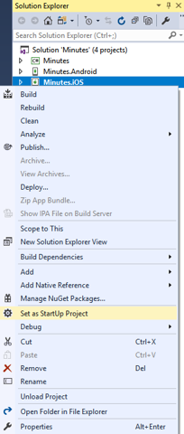

### Run the app

1.  On the **Standard** toolbar, locate the **Solution Platforms** drop-down.

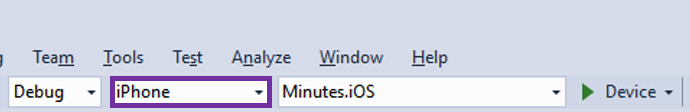

2.  Verify that the text on the **Solution Platforms** drop-down is **"iPhoneSimulator"**. If it is not, select the disclosure arrow on the side of the **Solution Platforms** drop-down and choose **"iPhoneSimulator"**.

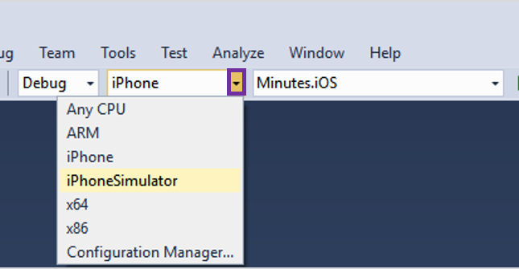

3.  Open the **Tools** **>** **Options...** menu.

4.  Navigate to the **Xamarin** **>** **iOS Settings** section.

5.  In the **"Simulator"** area, choose where the simulator window will be displayed.

    -   Check **Remote Simulator to Windows** to display the iOS simulator on the Windows PC.

    -   Uncheck **Remote Simulator to Windows** to show it on the Mac.

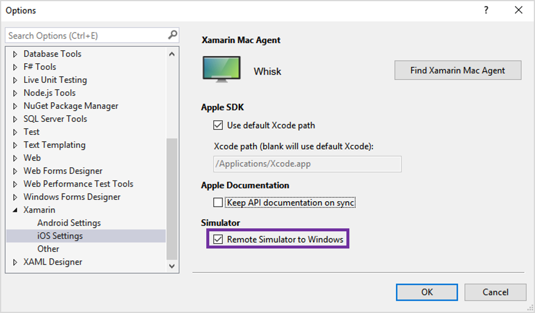

6.  Select the disclosure arrow on the side of the **Debug Target** button and choose your preferred iOS simulator from the context menu.

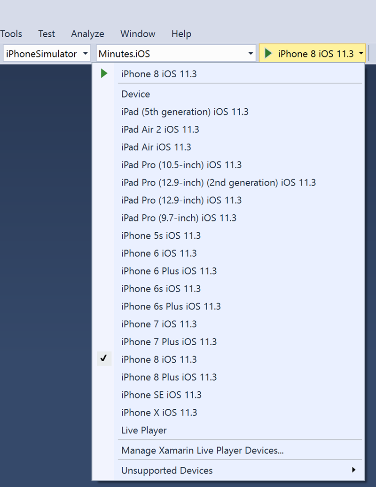

7.  Click the **Debug Target** button to run the app.

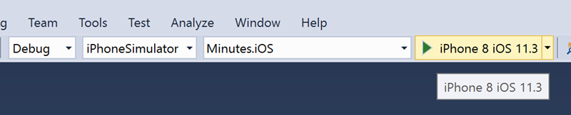

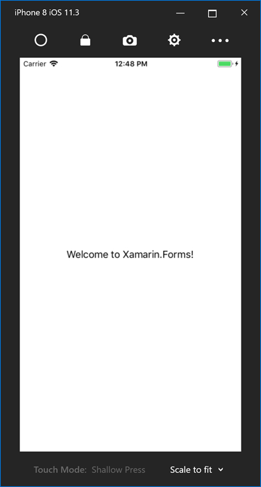

## 6. Code the NoteEntry class

Next you will implement the **NoteEntry** data-model class that holds the data for each entry put into the app.

### Create the C# class

1. Create a new **Data** folder in the **Minutes** shared-code project.

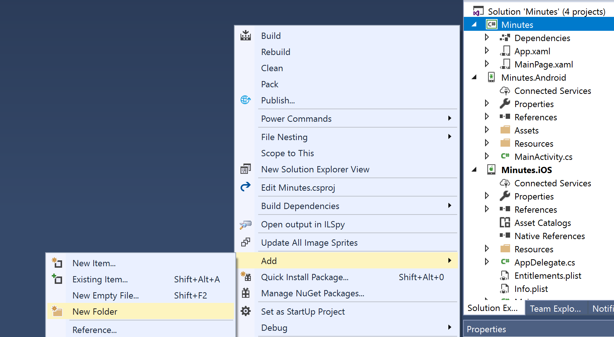

2.  Add a new class to the **Data** folder named **NoteEntry**.

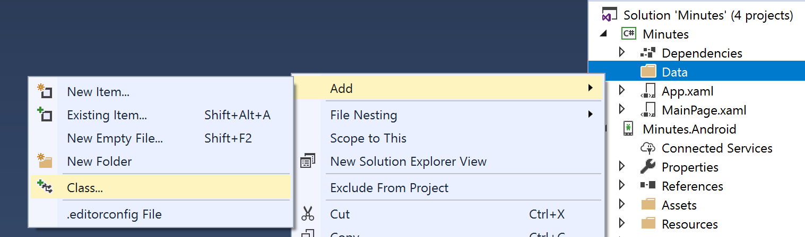
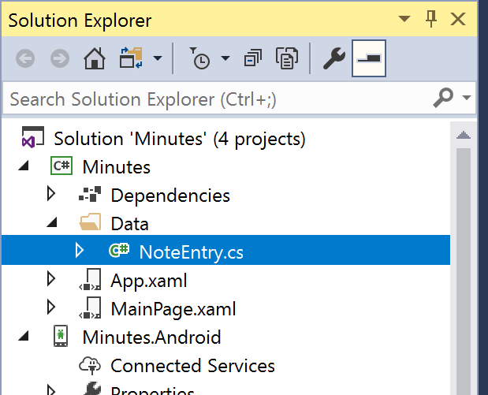

3.  Add `public` to the class definition.

```csharp
namespace Minutes.Data
{
    public class NoteEntry
    {
    }
}
```

### Add public properties to hold the data

1.  Add a public, read-write property of type `string` to the **Entry** class named **Title**.

2.  Add a public, read-write property of type `string` to the **Entry** class named **Text**.

3.  Add a public, read-write property of type `DateTime` to the **Entry** class named **CreatedDate**.

4.  Add a public, read-write property of type `string` to the **Entry** class named **Id**.

The completed code is shown below:

```csharp
public class NoteEntry
{
    public string Title { get; set; }
    public string Text { get; set; }
    public DateTime CreatedDate { get; set; }
    public string Id { get; set; }
}
```

### Initialize properties

1.  Add a public, default (no-argument) constructor to the **NoteEntry** class.

2.  Initialize the **CreatedDate** property to the current time. Use `DateTime.Now`.

3.  Initialize the **Id** property to a string derived from a `System.Guid` object. Use `Guid.NewGuid().ToString()`.

The completed code is shown below:

```csharp
public class NoteEntry
{
    ...
    public NoteEntry()
    {
        CreatedDate = DateTime.Now;
        Id = Guid.NewGuid().ToString();
    }
}
```

### Override ToString

1.  Override the `ToString` method in the **NoteEntry** class.

2.  Concatenate the entry's **Title** with the **CreatedDate** and return the result.

3.  Build the solution to check for syntax errors.

The completed code is shown below:

```csharp
public class NoteEntry
{
    ...
    public override string ToString()
    {
        return $"{Title} {CreatedDate}";
    }
}
```

**Note:** For single-line methods like this, you can condense the code by using C#'s expression bodied member syntax. As an example, the below code is exactly the same as above to C#, just shorter! You can use either approach based on what is easier for you to read and understand.

```csharp
public class NoteEntry
{
    ...
    public override string ToString() => $"{Title} {CreatedDate}";
}
```

## 7. Add a storage interface

Next, you will define an _abstraction_ for the storage class that collects all the notes together. You will start with a basic in-memory implementation so you can build the UI and test the logic. Later, you can switch to a persistent file so the **NoteEntry** data is saved to the device.

### Add a new interface

1. Create a new interface in the **Minutes** shared-code project. Name it `INoteEntryStore`.

2. Use the following definition for the interface:

```csharp
using Minutes.Data;
using System.Collections.Generic;
using System.Threading.Tasks;

namespace Minutes
{
    public interface INoteEntryStore
    {
        Task<NoteEntry> GetByIdAsync(string id);
        Task<IEnumerable<NoteEntry>> GetAllAsync();
        Task AddAsync(NoteEntry entry);
        Task UpdateAsync(NoteEntry entry);
        Task DeleteAsync(NoteEntry entry);
    }
}
```

> Notice the code is using `System.Threading.Tasks.Task` for all the return types. This is preparation for a later step where you will switch to a file-based storage model that uses asynchronous I/O APIs. 

| Method          | Purpose |
|-----------------|---------|
| `GetByIdAsync`  | Returns a specific note entry by looking it up via the unique `Id` property. |
| `GetAllAsync`   | Returns all the note entry objects as an `Enumerable` list. |
| `AddAsync`      | Adds a new entry to the collection. |
| `UpdateAsync`   | Update an existing entry in the collection. |
| `DeleteAsync`   | Delete an existing entry in the collection. |

## 8. Code the MemoryEntryStore class

Now, you will code the **MemoryEntryStore** class, which will store a collection of **NoteEntry** objects in memory. This will implement the `INoteEntryStore` interface.

### Create the class

1.  Add a new class to the **Data** folder in the **Minutes** shared-code project named **MemoryEntryStore**.

2.  Add `public` to the class definition.

3.  Add the interface to the class definition.

```csharp
public class MemoryEntryStore : INoteEntryStore
```

### Implement the methods

1.  Add a private, readonly dictionary field of type `Dictionary<string, NoteEntry>` to the class. Name it **entries**.

```csharp
private readonly Dictionary<string, NoteEntry> entries = new Dictionary<string, NoteEntry>();
```

2.  Add `using` statements for the **System.Linq** and **System.Threading.Tasks** namespaces to the top of the file. We'll need some of the extension methods and classes that are part of those namespaces.

```csharp
using System.Linq;
using System.Threading.Tasks;
```

3. Implement the **GetAllAsync** method by returning all the objects in the dictionary's `Values` property. Use `ToList()` to turn the value collection into an enumerable collection.

4. Use `Task.FromResult` to turn the `List` result into a `Task` return type to match the interface. Here's the code for convenience:

```csharp
public Task<IEnumerable<NoteEntry>> GetAllAsync()
{
    IEnumerable<NoteEntry> result = entries.Values.ToList();
    return Task.FromResult(result);
}
```

5. Implement the `AddAsync` method: add the passed `NoteEntry` to the dictionary, and return `Task.CompletedTask` to indicate success.

```csharp
public Task AddAsync(NoteEntry entry)
{
    entries.Add(entry.Id, entry);
    return Task.CompletedTask;
}
```

6. Implement `UpdateAsync` by returning `Task.CompletedTask`. The code isn't storing the data anywhere except memory so there's no work to do.

7. Implement `DeleteAsync` just like `AddAsync`; remove the item from the dictionary and return `Task.CompletedTask`.

8. Implement `GetByIdAsync` by looking up the proper `NoteEntry` and returning it using `Task.FromResult`. Here's the code for convenience:

```csharp
public Task<NoteEntry> GetByIdAsync(string id)
{
    NoteEntry entry = null;
    entries.TryGetValue(id, out entry);
    return Task.FromResult(entry);
}
```

9.  Build the solution to check for syntax errors.

### Create sample data

1.  Add a new class to the **Data** folder in the  **Minutes** shared-code project named **MockDataExtensionMethods**.

2.  Add `public` and `static` to the class definition.

3.  Add the code given below into the **MockDataExtensionMethods** class.

```csharp
using System.Threading.Tasks;

namespace Minutes.Data
{
    public static class MockDataExtensionMethods
    {
        public static void LoadMockData(this INoteEntryStore store)
        {
            NoteEntry a = new NoteEntry
            {
                Title = "Sprint Planning Meeting",
                Text = "1. Scope 2. Backlog 3. Duration"
            };

            NoteEntry b = new NoteEntry
            {
                Title = "Daily Scrum Stand-up",
                Text = "1. Yesterday 2. Today 3. Impediments"
            };

            NoteEntry c = new NoteEntry
            {
                Title = "Sprint Retrospective",
                Text = "1. Reflection 2. Actions"
            };

            Task.WhenAll(
                store.AddAsync(a),
                store.AddAsync(b),
                store.AddAsync(c))
            .ConfigureAwait(false);
        }
    }
}
```

### Instantiate the store

1. Open the file **App.xaml.cs** in the shared-code project.

2. Add the static property shown below to the **App** class. This will allow us to access the note storage from anywhere in the application.

```csharp
public static INoteEntryStore Entries { get; set; }
```

3. In the **App** constructor, instantiate a **MemoryEntryStore** object and assign it to the **Entries** property. You will need to add `using Minutes.Data;`.

4. In the **App** constructor, invoke the **LoadMockData** extension method on **Entries** to fill it with sample data.

5. Build the solution to check for syntax errors.

The code is shown below:

```csharp
public partial class App : Application
{
    public static INoteEntryStore Entries { get; set; }

    public App ()
    {
        InitializeComponent();

        Entries = new MemoryEntryStore();
        Entries.LoadMockData();

        MainPage = new Minutes.MainPage();
    }
    ...
}
```

## 9. Build the list of notes in XAML

The next task is to create the UI to display all the `NoteEntry` objects. This will replace the default UI you saw earlier.

You will display the list of `NoteEntry` objects in a **ListView** using the default visualization. The `ListView` class is used in Xamarin.Forms to display a scrollable, selectable list of data items. You see this style of UI in many mobile applications, and it's straight-forward to create in Xamarin.Forms.

### Add a ListView

1. Open **MainPage.xaml** in the shared-code project. This is the main page for the application which is setup in **App.xaml.cs** as part of the constructor.

2. Remove the contents of the `ContentPage` added by the starter template. When you are finished, the file should like the XAML shown below.

```xml
<?xml version="1.0" encoding="utf-8" ?>
<ContentPage xmlns="http://xamarin.com/schemas/2014/forms"
             xmlns:x="http://schemas.microsoft.com/winfx/2009/xaml"
             xmlns:local="clr-namespace:Minutes"
             x:Class="Minutes.MainPage">

</ContentPage>

```

3. Add a `ListView` inside the **ContentPage** tags.

> **Note:** Please use traditional start and end tags for the `ListView` instead of a self-closing tag; you will add code inside the `ListView` tags in a later step.

4. Use **x:Name** to assign the name **entries** to the `ListView`.

```xml
<ListView x:Name="entries">

</ListView>
```

### Set the ListView ItemsSource

1. Open **MainPage.xaml.cs**.

2. Override the `OnAppearing` method in the **MainPage** class.

3. You will be calling a `Task`-based method so add the `async` keyword to the `OnAppearing` method in front of the return type (`void`).

3. Inside `OnAppearing`, load the list of entries into the `ListView`. Make sure to use the `await` keyword as shown below:

```csharp
protected override async void OnAppearing()
{
    base.OnAppearing();
    entries.ItemsSource = await App.Entries.GetAllAsync();
}
```

4. Run the app on at least one platform. You should see the output of the `ToString` method displayed for each `NoteEntry` object.

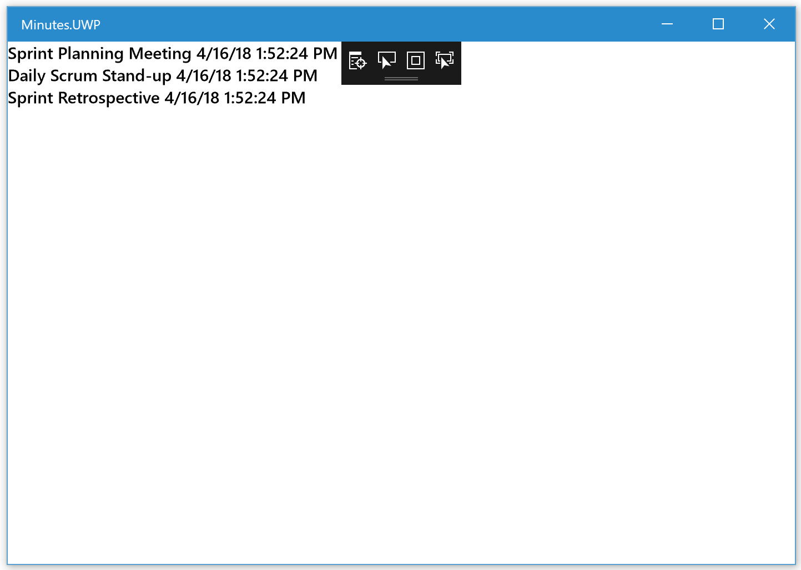

## 10. Use a better visualization for the notes

Next, you will customize the display of `NoteEntry` objects in the `ListView`. Currently, it is calling the `ToString` implementation to get a textual representation and  displaying it within a `Label` for each `NoteEntry`.

You'll change this by using a `DataTemplate` to direct the `ListView` on the proper visualization to use for each item.

There are two options available to us: First, (and best if it works for your app), is to use a built-in template; these are optimized and often correspond directly to a platform's native representation. This approach allows for one or two text items and an optional image.

If your app has requirements for displaying each item that cannot be fulfilled with these templates, you can define a [fully custom view](https://docs.microsoft.com/en-us/xamarin/xamarin-forms/app-fundamentals/custom-renderer/viewcell).

Since the `NoteEntry` objects just have text, you can use a built-in template: the `TextCell`.

### Specify the DataTemplate

1. Open **MainPage.xaml** in the shared-code project.

2. Locate the `ListView` in the XAML.

3. Add open and close tags for `ListView.ItemTemplate` inside the `ListView`.

4. Add open and close tags for a new `DataTemplate` inside the `ListView.ItemTemplate`.

5. Add a `TextCell` inside the `DataTemplate`.

All your subsequent work will be done inside the open tag of the `TextCell` so can use a self-closing tag for the `TextCell`.

6. Inside the `TextCell` element tag, assign the string "Title" to the `Text` property.

7. Inside the `TextCell` element tag, assign the string "Text" to the `Detail` property.

8. Inside the `TextCell` element tag, assign the color **Goldenrod** to the `DetailColor` property.

9. Run the app on at least one platform. You should see the hard-coded values "Title" and "Text" displayed for each item in the `ListView`.

The code is shown below for convenience.

```xml
<ListView x:Name="entries">
    <ListView.ItemTemplate>
        <DataTemplate>
            <TextCell
                Text="Title"
                Detail="Text"
                DetailColor="Goldenrod" />
        </DataTemplate>
    </ListView.ItemTemplate>
</ListView>>
```

### Add the data bindings

The goal is to display the data from each `NoteEntry` object. To do this, the app will utilize a built-in feature of Xamarin.Forms: **data binding**.

1. Open **MainPage.xaml** in the shared-code project.

2. Locate the `TextCell` in the XAML.

3. Replace the hard-coded assignment to `Text` with a `Binding` expression that displays the `Title` property of the underlying `Entry` object (see below).

```xml
<TextCell Text="{Binding Title}" ... />
```

4. Replace the hard-coded assignment to `Detail` with a `Binding` expression that displays the **Text** property of the underlying **NoteEntry** object. The full code is shown below for convenience.

```xml
<ListView x:Name="entries">
    <ListView.ItemTemplate>
        <DataTemplate>
        <TextCell
                Text="{Binding Title}"
                Detail="{Binding Text}"
                DetailColor="Goldenrod" />
        </DataTemplate>
    </ListView.ItemTemplate>
</ListView>
```

5.  Run the app on at least one platform. You should see the values from the **NoteEntry** objects displayed in the list.

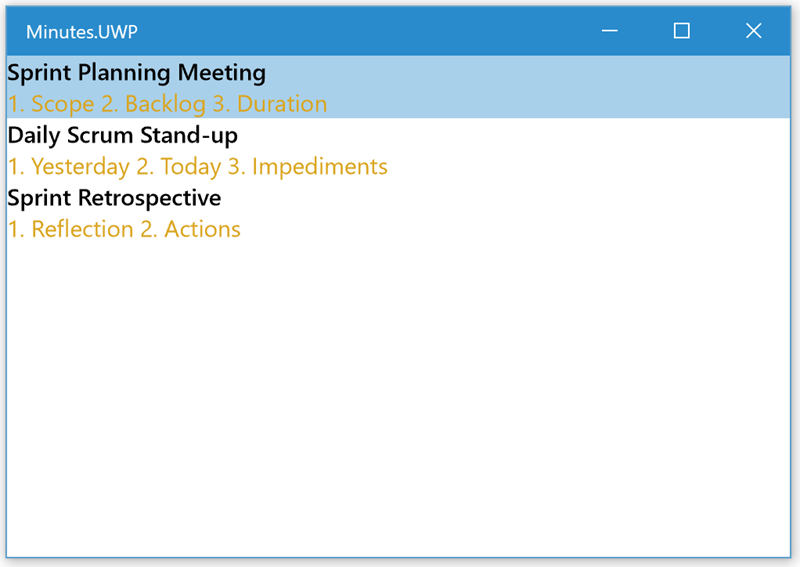

## 11. Add the edit screen

Now that the app is displaying notes, let's add a new screen to add / edit items so the user can customize the data.

### Create a new XAML ContentPage

1. Right-click on the **Minutes** shared-code project in the Solution Explorer and choose **Add** > **New Item**.

2. Select **Visual C# Items** > **Xamarin.Forms** in the left-hand panel. This will display all the Xamarin.Forms classes you can add.

3. Select **Content Page**, there are two of them; make sure the details screen indicates that the page uses XAML.


4. Name the new page **NoteEntryEditPage.xaml**.

5. Click **Add** to add the page.

This will add two files to the project: a XAML file which has the UI definition, and a C# code behind file where the page-specific behavior can be coded.

### Navigate to the new page

Now, update the code to display the new page when the user taps on one of the items in the `ListView`.

1. Open the **MainPage.xaml.cs** code behind file.
2. Locate the constructor, after the call to `InitializeComponent`, add an event handler to the `entries.ItemTapped` event. Name the method `OnItemTapped`.

```csharp
entries.ItemTapped += OnItemTapped;
```

3. Add the `OnItemTapped` method; you can auto-generate it with Visual Studio (right-click on the method name with the red-underline and select **Quick Actions and Refactorings...** > **Generate Method**) or type it yourself using a standard event handler signature with an `ItemTappedEventArgs`.

4. Get the item you have tapped on from the passed `ItemTappedEventArgs` - it's in the `Item` property and cast it to a `NoteEntry` object. You will need to add `using Minutes.Data;` either manually, or by right-clicking on the `NoteEntry` and selecting **Quick Actions and Refactorings...** > **Using Minutes.Data**).

5. Call `Navigation.PushAsync` and pass it a new instance of your `NoteEntryEditPage`.

6. That method is async, so apply the `async` and `await` keywords.

7. The page needs to know about the selected `NoteEntry`, an easy way to do this is to pass it into the constructor. Modify the constructor of the `NoteEntryEditPage` to take a `NoteEntry` and cache it into a private field. You will need to add `using Minutes.Data;` either manually, or by right-clicking on the `NoteEntry` and selecting **Quick Actions and Refactorings...** > **Using Minutes.Data**).

```csharp
private async void OnItemTapped(object sender, ItemTappedEventArgs e)
{
    NoteEntry item = e.Item as NoteEntry;
    await Navigation.PushAsync(new NoteEntryEditPage(item));
}
```

```csharp
private NoteEntry entry;

public NoteEntryEditPage (NoteEntry entry)
{
    InitializeComponent ();
    this.entry = entry;
}
```

8. Xamarin.Forms uses a standard paradigm for navigation; you used the method above (`Navigation.PushAsync`). To work on all platforms, you will need to add in a `NavigationPage` into the UI structure. Open the **App.xaml.cs** source file.

9. Locate the assignment of the `MainPage` property in the constructor.

10. Change the main page to be a `NavigationPage` object and pass in the existing `MainPage` object into the constructor of the new `NavigationPage`.

```csharp
public App ()
{
    InitializeComponent();
    ...
    MainPage = new NavigationPage(new Minutes.MainPage());
}
```

11. Run the app on at least one platform and tap on an entry in the `ListView`. It should navigate to your second page and display "Welcome to Xamarin.Forms!". You can go back using the built-in **Back** button located in the top-left corner.

12. You can customize the colors presented along the top of the `NavigationPage`. Let's update the page to use the same Blue as the launch screen. Open **App.cs** and on the `NavigationPage` class:
    - Set the static `BarBackgroundColor` property to `Color.FromHex("#3498db")`
    - Set the static `BarTextColor` property to `Color.White`

```csharp
MainPage = new NavigationPage(new Minutes.MainPage())
{
    BarBackgroundColor = Color.FromHex("#3498db"),
    BarTextColor = Color.White
};
```


### Add UI to display details

Next, let's change the second page UI to display the selected note's details.

1. Open the **NoteEntryEditPage.xaml** file and examine it's contents. It should have a `Label` that looks something like:

```xml
<Label Text="Welcome to Xamarin.Forms!" ... />
```

2. Delete the `Label`, this should leave the following definitions. If yours is different, go ahead and replace it to look like this:

```xml
<?xml version="1.0" encoding="utf-8" ?>
<ContentPage xmlns="http://xamarin.com/schemas/2014/forms"
             xmlns:x="http://schemas.microsoft.com/winfx/2009/xaml"
             x:Class="Minutes.NoteEntryEditPage">
    <ContentPage.Content>
        <StackLayout>

        </StackLayout>
    </ContentPage.Content>
</ContentPage>
```

3. Now, let's add UI to display details for each note. Add the following between the open and close tags of the `StackLayout`:

```xml
<Label Text="Title" />
<Entry Text="Bind to Title" />

<Label Text="Bind to CreatedDate" TextColor="Gray" HorizontalTextAlignment="End" />

<Label Text="Notes" />
<Frame VerticalOptions="FillAndExpand" HasShadow="False" Padding="0">
    <Frame.OutlineColor>
        <OnPlatform x:TypeArguments="Color">
            <On Platform="iOS" Value="LightGray" />
            <On Platform="Android" Value="Transparent" />
            <On Platform="UWP" Value="Transparent" />
        </OnPlatform>
    </Frame.OutlineColor>
    <Editor x:Name="textEditor" Text="Bind to Text" />
</Frame>
```

4. Next, add `Binding` statements to the `Entry`, `Label`, and `Editor` controls which have **Bind to xxx** on the `Text` properties. Remember that the binding objects take the form `{Binding PROPERTY_NAME}`.

5. The `Entry` and `Editor` are both _editing_ controls - the first for editing a single line of text, the second for multi-line editing. In XAML data binding, it's good practice to let the binding know you want to utilize two-way bindings and _push_ changes from the UI element back to the data source. You can do this by specifying `Mode=TwoWay` on the binding itself. Make sure to apply this for both the `Entry` and `Editor` binding objects as shown below.


```xml
<Entry Text="{Binding Title, Mode=TwoWay}" />
```

```xml
<Editor x:Name="textEditor" Text="{Binding Text, Mode=TwoWay}" />
```


6. The `CreatedDate` will display an (obnoxiously) long date format by default since it's a `DateTime` object. One cool trick you can use in Xamarin.Forms data binding is to provide a format string that's used when the object's `ToString()` is called. This is done through the `StringFormat` property on the binding. Use `'{0:g}'` for the `CreatedDate` so the app displays a "General" date/time string. The code is shown below for convenience.

```xml
<Label Text="{Binding CreatedDate, StringFormat='Created: {0:g}'}" TextColor="Gray" HorizontalTextAlignment="End" />
```

7. Finally, let's supply the data to the page. Set the `BindingContext` property to provide the _default_ binding source for any binding declared for the page. Open the **NoteEntryEditPage.xaml.cs** code behind file and locate the constructor.

8. Assign the passed `NoteEntry` to the built-in `BindingContext` property.

```csharp
public NoteEntryEditPage (NoteEntry entry)
{
    InitializeComponent ();
    BindingContext = this.entry = entry;
}
```

9. Run the app on at least one platform and tap on an entry in the `ListView`. It should show the note details!

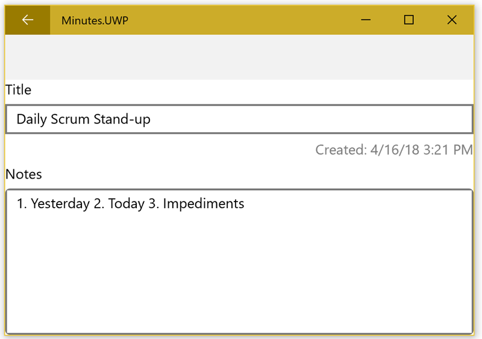

10. Try editing an entry's title and then pressing the **Back** button; it should be changed on the main page as well since it is referencing the same object in memory. However, this is _actually_ a bug since the code isn't calling `UpdateAsync`; it's just lucky that it works in _this_ case. 

11. Open the **NoteEntryEditPage.xaml.cs** code behind file.

12. Override the `OnDisappearing` method. This is called when the page is being destroyed and the app is transitioning back to the main page.

13. If the `entry` field is not `null`, then call `App.Entries.UpdateAsync` to update the values in the note storage. You will need to apply the `async` and `await` keywords.

```csharp
protected override async void OnDisappearing()
{
    base.OnDisappearing();

    if (entry != null)
    {
        await App.Entries.UpdateAsync(entry);
    }
}
```

14. Run the app again and set a breakpoint to see the behavior; the runtime behavior won't change, but we've corrected the oversight.

### Setting focus

When the user edits an entry, they will often want to immediately begin typing. Currently, the user must tap on the field to begin editing. Let's change that behavior by setting focus automatically.

1. Open  **NoteEntryEditPage.xaml.cs**.

2. Override the `OnAppearing` method and add a call to `textEditor.Focus()`. This will place focus on the `Editor` control when the screen is displayed.

3. Run the app and show the details for a note; it should show the onscreen keyboard for that item.

> On some devices, typically phones, you might _not_ want this behavior since it can cover content on a small screen. You can restrict this to be desktop-only using the `Device.RuntimePlatform` flag.

4. In the `OnAppearing` override, check the `Device.Idiom` property for either `TargetIdiom.Desktop` or `TargetIdiom.Tablet` and only change focus if it's one of those two platforms.

> **Note**: We could also check the `Device.RuntimePlatform` property for a specific platform such as UWP if we wanted to be more specific.

```csharp
protected override void OnAppearing()
{
    base.OnAppearing();
    if (Device.Idiom == TargetIdiom.Desktop
        || Device.Idiom == TargetIdiom.Tablet)
    {
        textEditor.Focus();
    }
}
```

### Adding a title

Notice that the screen looks a bit crammed, and there's a blank bar across the top. This is due to the navigation support you just added to the app. This blank area is a convenient place for a _Title_ to be displayed. Let's adjust a few properties on the main and detail pages to take advantage of this.

1. Open **NoteEntryEditPage.xaml** and locate the `ContentPage` root element.

2. Assign the `Title` property to `{Binding Title}` to use the title of the current `NoteEntry` object.

3. Assign the `Padding` property to "20" to add a little space around the entire UI (20 units).

```xml
<ContentPage xmlns="http://xamarin.com/schemas/2014/forms"
             xmlns:x="http://schemas.microsoft.com/winfx/2009/xaml"
             x:Class="Minutes.NoteEntryEditPage"
             Title="{Binding Title}"
             Padding="20">
```

4. Open the **MainPage.xaml** file and locate the same root element.

5. Set the `Title` property to "Meeting Minutes", and the `Padding` property to "20".

6. Run the app on at least one platform; notice the difference with the titles on each page.

> On some platforms, you may notice that the `MainPage` title is being used as the "Back" text. Since that title is quite long, it can look awkward - however there's a cool trick in Xamarin.Forms that will let you address that.

7. Open **MainPage.xaml** and locate the root `ContentPage` element.

8. Set the `NavigationPage.BackButtonTitle` property to the text "Minutes".

9. Run the app on iOS and notice that the back text on the details page is now "Minutes".

## 12. Create a new note

Now that the app can display and update notes, let's add support to **Add** a new note. You can do this by adding a new `Entry` edit box to the **MainPage**.

### Add a New Text Entry

1. Open **MainPage.xaml** and locate the `ListView`. It's currently the only UI element on the page.

2. Surround the `ListView` with a `StackLayout`.

```xml
<StackLayout>
    <ListView x:Name="entries">
        <ListView.ItemTemplate>
            <DataTemplate>
                <TextCell
                    Text="{Binding Title}"
                    Detail="{Binding Text}"
                    DetailColor="Goldenrod" />
            </DataTemplate>
        </ListView.ItemTemplate>
    </ListView>
</StackLayout>
```

3. Put an `Entry` element above the `ListView`, set the `x:Name` to "newEntry".
    - Set the `PlaceHolder` property to "Add a new Entry".
    - Set the `Margin` property to "0,0,0,20". This adds a 20 unit space below the control to separate it from the `ListView`.

```xml
<Entry x:Name="newEntry" Placeholder="Add a new Entry" Margin="0,0,0,20" />
```

### Implement the logic to add a new Note

1. Open the code behind file (**MainPage.xaml.cs**) and locate the constructor.

2. After the `InitializeComponent` method, add a `Completed` event handler to the **newEntry** control. Wire it up to a method named **OnAddNewEntry**.

```csharp
public MainPage()
{
    InitializeComponent();
    ...
    newEntry.Completed += OnAddNewEntry;
}
```

3. Create the `OnAddNewEntry` method. It is a standard event handler.

4. In the method, get the `Text` value from the **newEntry** control and store it in a variable.

5. If the string is _not_ empty, create a new `NoteEntry` object and use the text as the `Title`.

6. Add the new note to the note entry store (`App.Entries.AddAsync`). Make sure to use the `await` keyword (which means you'll need to add an `async` keyword to the method!).

7. Copy the code you used in `OnItemTapped` to navigate to the `NoteEntryEditPage` screen, passing it your new item. Make sure to use `await`.

8. Finally, set the `newEntry.Text` property to an empty string to clear it out _after_ the navigation call - this will clear the UI so that the `Entry` is empty when the app navigates back to this page.

```csharp
private async void OnAddNewEntry(object sender, EventArgs e)
{
    string text = newEntry.Text;
    if (!string.IsNullOrWhiteSpace(text))
    {
        NoteEntry item = new NoteEntry { Title = text };
        await App.Entries.AddAsync(item);
        await Navigation.PushAsync(new NoteEntryEditPage(item));
        newEntry.Text = string.Empty;
    }
}
```

9. Run the app on at least one platform and check out the new UI.


10. Try adding a new item by typing some text in the field and pressing **ENTER** or **RETURN** on the keyboard.

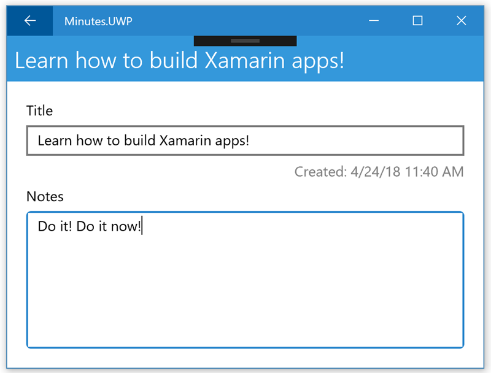

## 13. Delete a note

The final missing feature is support to _delete_ a note. You will do this by adding a button to the **Details** page.

### Add Toolbar button on the Details page

1. Open **NoteEntryEditPage.xaml**.

2. After the `ContentPage` open tag, add a new `ToolbarItem`. This needs to be in the `ToolbarItems` collection; use the following XAML to define it:

```xml
<ContentPage xmlns="http://xamarin.com/schemas/2014/forms"
    ...>
    <ContentPage.ToolbarItems>
        <ToolbarItem Text="Delete" Icon="delete.png" Clicked="OnDeleteEntry" />
    </ContentPage.ToolbarItems>
    ...
</ContentPage>
```

> This will add a new Button to the navigation toolbar. Since the app is using a `NavigationPage`, this is a great area to put extra functionality relevant to the screen.

3. Open **NoteEntryEditPage.xaml.cs** and add an event handler method named **OnDeleteEntry** to handle the button click.

4. In the event handler, ask the user whether they _really_ want to delete the note. You can use the built-in `DisplayAlert` method which is part of the `ContentPage` base class. It takes a minimum of three parameters, with an optional fourth if you need a cancel button:
    - **Title** - set this to `"Delete Entry?"`
    - **Description** - set this to `$"Are you sure you want to delete the entry {Title}?"`
    - **OK Button Text** - set this to `"Yes"`
    - **Cancel Button Text** - set this to `"No"`

5. `DisplayAlert` is asynchronous and returns a true/false depending on which choice  the user makes. Use `await` to get the value.

6. If the user taps "OK", remove the selected note (`entry` field) from the note store (`App.Entries.DeleteAsync`).

7. Set the `entry` field to **null** so the code doesn't try to update it later.

8. Call `Navigation.PopAsync` to return to the main screen. This is also an `await`able operation.

```csharp
private async void OnDeleteEntry(object sender, EventArgs e)
{
    if (await DisplayAlert("Delete Entry", $"Are you sure you want to delete the entry {Title}?", "Yes", "No"))
    {
        await App.Entries.DeleteAsync(entry);
        entry = null; // deleted!
        await Navigation.PopAsync();
    }
}
```

### Add the delete.png image

The `ToolbarItem` needs an image, particularly on UWP where no text is displayed by default. Images and graphics are often one of the areas where you will need to provide _platform-specific_ values because the sizes change from platform-to-platform.

There are three folders in the [assets folder](https://github.com/XamarinUniversity/build2018-labs/tree/master/lab1/assets) included with this lab. You will need to copy the images from the **ios**, **android**, and **windows** folders into the project.

#### Android

1. Open the **assets** folder in an Explorer or Finder window.

2. In Visual Studio, expand the **Minutes.Android** project and expand the **Resources** folder in the Solution Explorer. You should see several **drawable** folders:

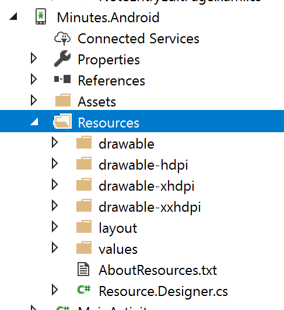

3. **Drag** the contents from each folder in **assets** into the same-named folder in Visual Studio. On Windows, you can drag the entire folder, on the Mac you need to drag each file (folder drags _replace_ the folder which isn't what you want!)

4. Expand each of the folders in VS and verify that the **delete.png** file is there

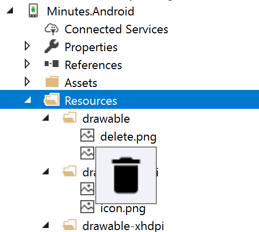

5. Select each one and verify that the properties indicate the **Build Action** is set to **AndroidResource**


#### iOS

1. In Visual Studio, expand the **Minutes.iOS** project in the Solution Explorer. Locate the **Asset Catalogs** node in the project; right-click on it and select **Add Asset Catalog**.

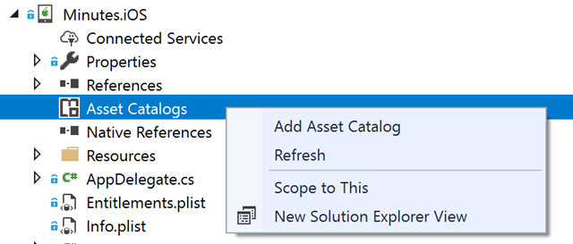

2. In the dialog, make sure **Asset Catalog** is selected, and that the name is **Assets** since this is the first one. Click **Add** to add the item to the project.

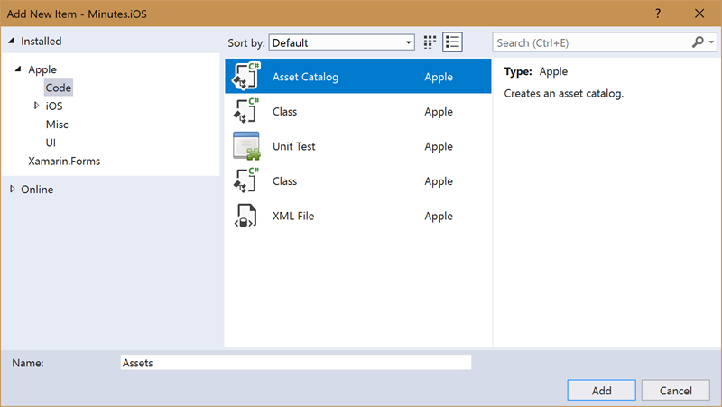

3. If the new asset catalog (**Assets**) doesn't open on it's own, double click on it in the project.

4. Click the **(+)** button in the top left corner to add a new asset and select **Add Image Set** from the popup menu.

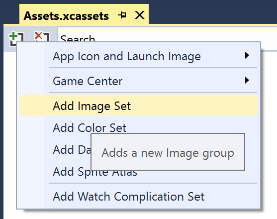

5. **Drag** the three icons in the **ios** folder from **assets** into the new Image Set. You should match the name to the placeholder - for example, **delete@2x.png** should be placed into the box labeled **2x** as shown below:

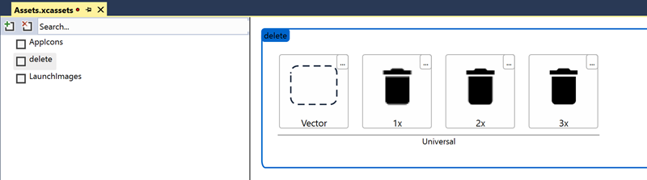

6. Close the asset catalog.

#### UWP

1. In Visual Studio, expand the **Minutes.UWP** project.

2. **Drag** the single **delete.png** icon in the **windows** folder from **assets** into the root of the UWP project.

3. Select the icon in the Solution Explorer and verify that the **Build Action** is set to **Content**.

### Test the delete function

1. Run the app on any platform.

2. Select an entry in the `ListView`.

3. Tap the trash can icon in the top right corner. You should see your prompt.

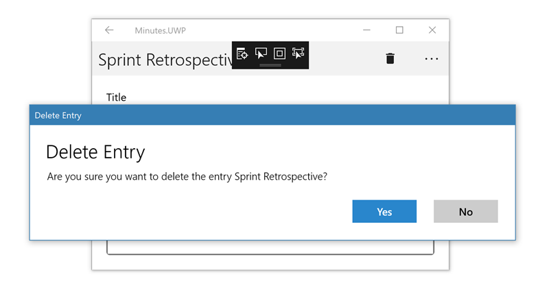

4. Selecting "Yes" should delete the entry and return you to the main page and the will be gone; selecting "No" should stay on the details screen.

## 14. Add persistent storage

The final step is to add a persistence data store so that the notes are saved when the user starts and stops the app. It will store the list of notes in an XML file with the following structure:

```xml
<minutes>
  <entry title="The Title" text="The description" createdDate="2018-04-16" />
  <entry title="The Title" text="The description" createdDate="2018-04-16" />
  <entry title="The Title" text="The description" createdDate="2018-04-16" />
</minutes>
```

This requires that you implement a new `INoteEntryStore` implementation to save to a file. You could also use SQLite, or a cloud service such as Azure to store your data.

### Create the FileEntryStore

1. Create a new C# class in the **Data** folder. Name it **FileEntryStore**.

2. Have the class implement the `INoteEntryStore` interface. You can right-click on the interface itself, select **Quick Actions and Refactorings...** and get Visual Studio to stub out all the required methods.

3. Add a field of type `List<NoteEntry>` to hold the loaded entries from the file. Name the field **loadedNotes**.

4. Add a field of type `string` to hold the filename.

5. Add a public, default (no-argument) constructor to the class and set the filename field using the following code and adding the appropriate `using` directive:

```csharp
string folder = Environment.GetFolderPath(Environment.SpecialFolder.InternetCache);
if (string.IsNullOrEmpty(folder))
   folder = Environment.GetFolderPath(Environment.SpecialFolder.LocalApplicationData);
this.filename = Path.Combine(folder, "minutes.xml");
```

> This code stores the file into the proper location on all supported platforms. Each platform has different requirements, but luckily this API abstracts that knowledge away from us.

### Add code to read the file from disk

1. Add a static method named `ReadDataAsync` to `FileEntryStore` that takes a `string` filename and returns a `Task<IEnumerable<NoteEntry>>`. Since it will load from a file, it's more efficient to use the async file I/O features of .NET; add the `async` keyword to the method signature.

```csharp
private static async Task<IEnumerable<NoteEntry>> ReadDataAsync(string filename)
{
}
```

2. First check if the file exists using the `File.Exists` API, and if not, return `Enumerable.Empty<NoteEntry>()`. You will need to add a `using` directive for the **System.Linq** namespace.

3. If the file _does_ exist, use a `StreamReader` to load the file; use the `ReadToEndAsync` method and apply the `await` keyword.

4. Next, check the returned string and make sure it has data; if not, return `Enumerable.Empty<NoteEntry>()`.

5. Finally, use the following code to parse the XML text with the `XDocument` class (from the **System.Xml.Linq** namespace, so you will need to add a `using` directive) to turn XML into an object graph:

```csharp
IEnumerable<NoteEntry> result =
    XDocument.Parse(text)
        .Root
        .Elements("entry")
        .Select(e =>
            new NoteEntry
            {
                Title = e.Attribute("title").Value,
                Text = e.Attribute("text").Value,
                CreatedDate = (DateTime)e.Attribute("createdDate")
            });
```

6. Return the enumerable data from the method.

The final code for the method is shown below:

```csharp
private static async Task<IEnumerable<NoteEntry>> ReadDataAsync(string filename)
{
    if (!File.Exists(filename))
    {
        return Enumerable.Empty<NoteEntry>();
    }

    string text;
    using (StreamReader reader = new StreamReader(filename))
    {
        text = await reader.ReadToEndAsync().ConfigureAwait(false);
    }

    if (string.IsNullOrWhiteSpace(text))
    {
        return Enumerable.Empty<NoteEntry>();
    }

    IEnumerable<NoteEntry> result = XDocument.Parse(text)
            .Root
            .Elements("entry")
            .Select(e =>
                new NoteEntry
                {
                    Title = e.Attribute("title").Value,
                    Text = e.Attribute("text").Value,
                    CreatedDate = (DateTime)e.Attribute("createdDate")
                });

    return result;
}
```

### Add code to write the collection to disk

1. Add a static method named **SaveDataAsync** that takes a filename and an enumerable collection of `NoteEntry` objects and returns a `Task`.

2. Take the collection of notes and turn it into XML with the following C# code that uses LINQ to XML:

```csharp
XDocument root = new XDocument(
    new XElement("minutes",
        notes.Select(n =>
            new XElement("entry",
                new XAttribute("title", n.Title ?? ""),
                new XAttribute("text", n.Text ?? ""),
                new XAttribute("createdDate", n.CreatedDate)))));
```

3. Use the `StreamWriter` class to write the `XDocument` to the given filename. Use the asynchronous `WriteAsync` method, and use the `ToString()` method on the `XDocument` to turn it into text.

The final code is shown below:

```csharp
private static async Task SaveDataAsync(string filename,
                                IEnumerable<NoteEntry> notes)
{
    XDocument root = new XDocument(
        new XElement("minutes",
            notes.Select(n =>
                new XElement("entry",
                    new XAttribute("title", n.Title ?? ""),
                    new XAttribute("text", n.Text ?? ""),
                    new XAttribute("createdDate", n.CreatedDate)))));

    using (StreamWriter writer = new StreamWriter(filename))
    {
        await writer.WriteAsync(root.ToString()).ConfigureAwait(false);
    }
}

```

### Initialize the FileEntryStore

1. Add a method named `InitializeAsync` that returns a `Task`. This method will be used to initialize the **loadedNotes** field. It will be called from each method to ensure the data has been loaded prior to doing anything else.

2. Check the **loadedNotes** field for `null`. If it is not initialized, call the `ReadDataAsync` method to get the `IEnumerable` of notes.

3. Use the `await` keyword and put the resulting `IEnumerable` into a `List<NoteEntry>` and assign it to the **loadedNotes** field.

```csharp
private async Task InitializeAsync()
{
    if (loadedNotes == null)
    {
        loadedNotes = (await ReadDataAsync(filename)).ToList();
    }
}
```

### Implement the Add support

1. Add the `AddAsync` method to the class if you haven't already.

2. Call `InitializeAsync` to ensure the notes are loaded from disk. Use the `async` and `await` keywords.

3. Check whether the passed `NoteEntry` is already present in the **loadedNotes**. The easiest way to do this is by checking the `Id` property.

4. If the entry is _not_ present, add it to the **loadedNotes** collection.

5. Call `SaveDataAsync` to write the data back to disk.

```csharp
public async Task AddAsync(NoteEntry entry)
{
    await InitializeAsync();

    if (!loadedNotes.Any(ne => ne.Id == entry.Id))
    {
        loadedNotes.Add(entry);
        await SaveDataAsync(filename, loadedNotes);
    }
}
```

### Implement the Delete support

1. Add the `DeleteAsync` method to the class if you haven't already.

2. Call `InitializeAsync` to ensure the notes are loaded from disk. Use the `async` and `await` keywords.

3. Remove the passed note from the **loadedNotes** collection. The `Remove` method returns a true/false whether any matching item was found.

3. Call `SaveDataAsync` to write the data back to disk if an item was removed.

```csharp
public async Task DeleteAsync(NoteEntry entry)
{
    await InitializeAsync();

    if (loadedNotes.Remove(entry))
    {
        await SaveDataAsync(filename, loadedNotes);
    }
}
```

### Implement the Get support

1. Add the `GetAllAsync` method to the class if you haven't already.

2. Call `InitializeAsync` to ensure the notes are loaded from disk. Use the `async` and `await` keywords.

3. Return the **loadedNotes** collection ordered by `CreatedDate` in descending order.

```csharp
public async Task<IEnumerable<NoteEntry>> GetAllAsync()
{
    await InitializeAsync();
    return loadedNotes.OrderByDescending(n => n.CreatedDate);
}
```

4. Add the `GetByIdAsync` method to the class if you haven't already.

5. Call `InitializeAsync` to ensure the notes are loaded from disk. Use the `async` and `await` keywords.

6. Return the specific note from the **loadedNotes** collection using the `Id` to find it.

```csharp
public async Task<NoteEntry> GetByIdAsync(string id)
{
    await InitializeAsync();
    return loadedNotes.SingleOrDefault(n => n.Id == id);
}
```

### Add the Update support

1. Add the `UpdateAsync` method to the class if you haven't already.

2. Call `InitializeAsync` to ensure the notes are loaded from disk. Use the `async` and `await` keywords.

3. Add a test to ensure that the passed note is in the **loadedNotes** collection. If not, throw an exception.

3. Call `SaveDataAsync` to push any changes to in-memory objects back to disk.

```csharp
public async Task UpdateAsync(NoteEntry entry)
{
    await InitializeAsync();

    if (!loadedNotes.Contains(entry))
    {
        throw new Exception($"NoteEntry {entry.Title} was not found in the {nameof(FileEntryStore)}. Did you forget to add it?");
    }

    await SaveDataAsync(filename, loadedNotes);
}
```

### Switch to the file-based storage

1. Open the **App.xaml.cs** file and locate the line where the `Entries` property is assigned.

2. Comment out the existing `MemoryEntryStore` and replace it with a new `FileEntryStore`.

3. Comment out the `LoadMockData` call on the next line - there's no need to use test data anymore.

4. Run the app on at least one platform. You should be able to add/update and delete notes just as before.

5. Close the app (force it to close using the platform-specific gesture if necessary.

6. Run the app again; you should _still_ see your data.

## Congratulations!

You have completed this lab and built a Xamarin.Forms application that runs on multiple platforms, manipulates data, uses multiple screens, and stores data in a local file!

Keep learning about building mobile apps with Xamarin by creating a FREE account at [Xamarin University](https://university.xamarin.com)!
