# Connect your mobile app to the cloud with Azure App Services

### Estimated completion time: 60-75 minutes

In this lab you will modify a Xamarin.Forms application to utilize a few Azure services. 

The app you will be working with is a community chat application named **My Circle**. It's a  simple application which allows a group of people to communicate in a public forum. Initially, it will work with local data only (mostly generated randomly). Your goal will be to connect this app to Azure and provide a global, cloud-based data store so the app becomes a community connected application.

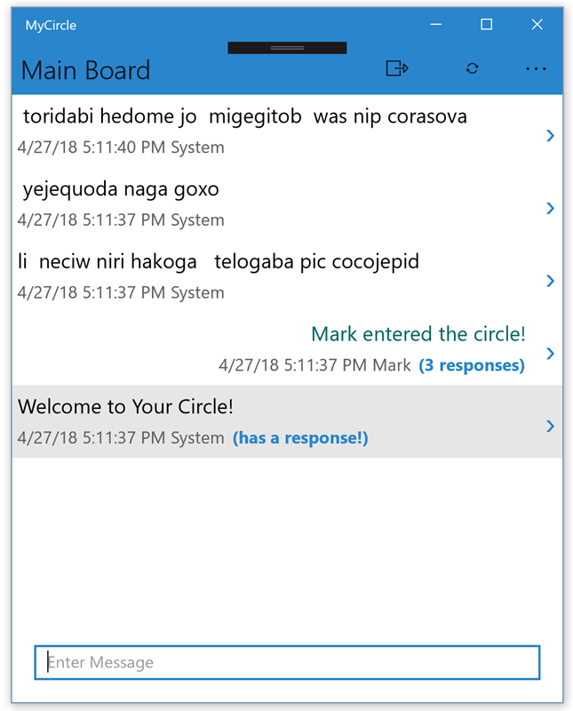 

## Table of Contents
1. [Add Support for Azure storage](#part-1-add-support-for-azure) - You will add the initial support to connect the app to Azure App Services and store data in the cloud.

2. [Add Speech to Text features](#part-2-add-speech-services) - You will add support for Azure Speech to Text cognitive services.

3. [Add Offline data synchronization](#part-3-add-offline-sync) - You will finish the app by adding support for offline data synchronization so it behaves properly when the network is unavailable.

## Prerequisites

This lab uses Visual Studio 2017 on Windows with the Xamarin, UWP, and Azure workloads installed. It utilizes an existing Xamarin.Forms application with target projects for iOS, Android, Windows (UWP), and macOS. You can also use Visual Studio for Mac to complete this lab, however a few of the steps might not match completely.

> **Note** This lab assumes you are running Visual Studio on Windows 10 Fall Creators Update. If you are using an older version of Windows, you might not be able to run the UWP version of the application. In this case, you can skip those sections and concentrate on either iOS and/or Android.

## What you will learn
This lab focuses on integrating Azure services into a Xamarin app - particularly the services built specifically for Mobile Apps. At the end of the lab, you will have a good understanding of how to leverage these services in your own apps, as well as a starting point to explore other Azure services.

The lab demonstrates working with these services:

1. [Azure App Services for Mobile Apps](https://azure.microsoft.com/en-us/services/app-service/mobile/)
2. [Azure Speech to Text cognitive services](https://docs.microsoft.com/en-us/azure/cognitive-services/speech/home)
3. [Azure App Services Mobile App Offline Synchronization](https://docs.microsoft.com/en-us/azure/app-service-mobile/app-service-mobile-ios-get-started-offline-data)

## Download the code

You can download the starter code [here](https://github.com/XamarinUniversity/build2018-labs/archive/master.zip) as a .zip file, or clone the repo with the following command-line:

```shell
git clone https://github.com/XamarinUniversity/build2018-labs.git
```

> **Note:** There are two labs in this Github repository. Make sure you are working with the contents of the **lab2** folder for this walk-through.

## Explore the Starter Solution

Let's start by exploring the starter solution. In the materials associated with this walk-through, you will find several folders:

| Folder    | Purpose |
|-----------|---------|
| **start** | The starting lab solution. |
| **part1** | The completed solution for Part 1 |
| **part2** | The completed solution for Part 2 |
| **part3** | The completed solution for Part 3 |

> It is recommended that you _copy_ each folder to another local location, preferably one with a short path to avoid any path restrictions on your development system.

1. Open the **MyCircle.sln** solution in the **start** folder.

2. There are five projects in this solution:
	- **MyCircle** - a .NET Standard shared-code project where most of the changes will be performed.
	- **MyCircle.Android** - the Xamarin.Android host which runs the app on the Android platform.
	- **MyCircle.iOS** - the Xamarin.iOS host which runs the app on the iPhone and iPad.
	- **MyCircle.Mac** - the Xamarin.Mac host which runs the app on macOS.
	- **MyCircle.UWP** - the Universal Windows host which runs the app on Windows 10.

All of the changes will be in the first project. This is a .NET Standard library which has all the shared code and UI definitions for the app.

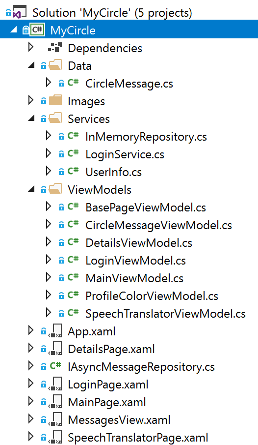

### Data Folder

The **Data** folder holds model objects - these are underlying data objects which represent some state in the app. 

The only model object defined is `CircleMessage` which is used to represent a single message sent or received from the app. It holds the `Author`, `Color`, and `Text` for a single message.

### Services Folder

The **Services** folder holds global services used by the application to perform some work.

| Service | Description |
|---------|-------------|
| `InMemoryRepository` | This is a sample in-memory implementation of the `IAsyncMessageRepository` interface. It is used in the starter to provide the storage for all the `CircleMessage` objects. You will replace this class in **part1** with a repository that connects to Azure. |
| `LoginService` | This service provides the ability for a user to login and logout of the application. |
| `UserInfo` | This service stores the currently logged on user in persistent storage using the built-in Xamarin.Forms properties collection. |

### ViewModels Folder

The app relies on the [Model-View-ViewModel design pattern](https://docs.microsoft.com/en-us/xamarin/xamarin-forms/enterprise-application-patterns/mvvm) to provide bindable view-centric data objects for the UI. The **ViewModels** folder defines each of the bindable ViewModels.

| ViewModel | Description |
|-----------|-------------|
| `BasePageViewModel` | A base class for `MainViewModel` and `DetailsViewModel` which have some shared functionality. In particular, this class supports adding a new `CircleMessage` to the system and providing a collection of `CircleMessageViewModel` objects for the UI to display. |
| `CircleMessageViewModel` | A bindable wrapper around the `CircleMessage` data model |
| `DetailsViewModel` | The ViewModel for the `DetailsPage` |
| `LoginViewModel` | The ViewModel for the `LoginPage` |
| `MainViewModel` | The ViewModel for the `MainPage` |
| `ProfileColorViewModel` | A ViewModel to hold a `Color` and current selection used in the `LoginPage` |
| `SpeechTranslatorViewModel` | A ViewModel for the `SpeechTranslatorPage` |

### XAML User Interface definitions

The app uses [XAML](https://docs.microsoft.com/en-us/xamarin/xamarin-forms/xaml/xaml-basics/) to construct and display the user interface for each page. Each XAML file has a corresponding code-behind (**xaml.cs**) file, which may have a little connecting logic in it, particularly for navigation. However, most of the programmed logic is contained in the [ViewModels Folder](#viewmodels-folder).

| XAML | Description |
|------|-------------|
| **App.xaml** | The main `Application` for the app - this is a singleton which is created as part of the app launch sequence and is the starting point for the app. |
| **DetailsPage.xaml** | This page displays the thread details for a conversation. At the top is the starting point, and then each response is displayed in a scrollable list. |
| **LoginPage.xaml** | This page is the first displayed UI in the app when the app has not been launched before. It allows the user to enter their name and select a color for their messages. You can also reach this app by tapping the Logout button on the main page. |
| **MainPage.xaml** | This page is the primary page which displays all the "root" conversations - these are starting points for any conversation thread. You can tap on a specific message to display the details. |
| **MessagesView.xaml** | This is a `ContentView` which is shared between the **MainPage.xaml** and **DetailsPage.xaml** to display a list of messages and a "New Message" `Entry` UI widget. |
| **SpeechTranslatorPage.xaml** | This is a starting point for the UI related to **part2** of the lab. It is incomplete and will be used as part of that step. |

## Run the starter application

1. Build the application in Visual Studio.

2. Select one of the supported platforms and set it as the Startup Project by right-clicking on the project in the Solution Explorer and selecting *Set as Startup*. Alternatively, you can use the platform drop-down in the toolbar which is next to the **Play** button.

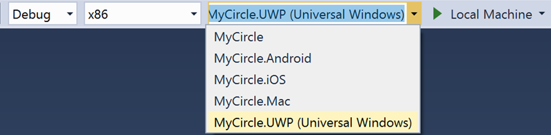

> **Note:** The UWP app is only available if you are running on Windows, and the Mac app is only available if you are running on macOS. In addition, you must have a Mac to run the iOS project.

3. Run the application by clicking the **Play** button in the toolbar, or through the menu. Initially, you will be shown the **LoginPage**:

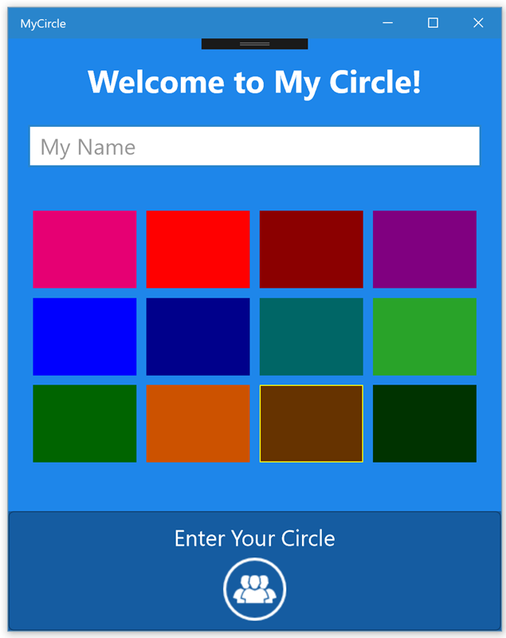

4. Type your name and select a color. Then tap the Circle icon at the bottom to enter the app.

5. You will now be presented with a series of messages.


6. The Toolbar at the top has two icons:

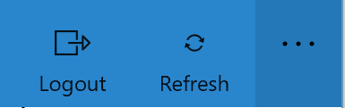

7. Tap the "Refresh" icon to see new messages. Alternatively, on iOS and Android, you can use the "Pull to refresh" gesture. These new messages are generated internally by the app for testing.

8. You can add your own message by typing it into the `Entry` at the bottom of the page and pressing **ENTER** or **RETURN**.

9. Finally, when there is a response to a root message here, you will see a text marker indicating that replies are available:

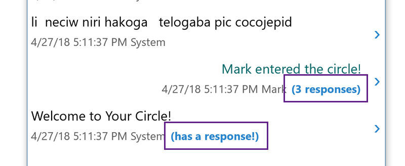

10. You can tap on that message to see the details, or to enter your own response.

## Create the Azure Mobile App Service

Let's start by creating an Azure Mobile App Service that the mobile app can use to store data in the cloud. There is an existing version of this service located at https://build2018mycircle.azurewebsites.net, however it likely won't be around forever, so you can use these steps to create your own version of the service. 

In addition, the source code for the pre-supplied service is located in this Github repo [here](https://github.com/XamarinUniversity/build2018-labs/tree/master/lab2/azure-service).

If you want to use the pre-supplied service, you can skip to [Part One](#part-1-add-support-for-azure) where you will add support for Azure to the app.

> **Note**: at this time, this part of the lab can only be done on Visual Studio for Windows. Once you have the service, you can use Visual Studio for Mac; alternatively, you can create the service using the [Azure Portal](https://portal.azure.com).

### Create the Azure Mobile App Service solution

1. Open Visual Studio for Windows.

2. Use the **File** > **New** > **Project...** menu option to open the New Project wizard.

3. Select the **Visual C#** > **Web** > **ASP.NET Web Application (.NET Framework)** template.

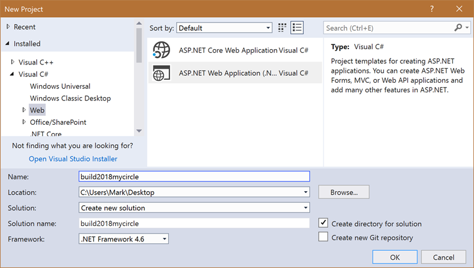

4. Name the solution something easy to remember, the lab uses **build2018mycircle**, but each name in Azure needs to be unique as it is turned into the URL when published - so don't use that name directly, add a number into it, or even name it something completely different.

5. Click **OK** to start the wizard.


### Set the web app options

1. Select **Azure Mobile App** from the set of choices.

2. Leave all other options as their defaults and click **OK** to create the web app.

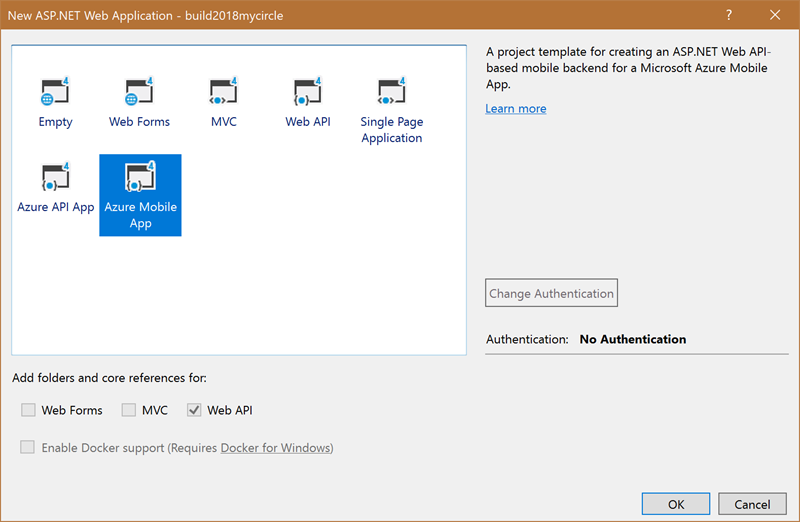

### Change the default model to CircleMessage

The wizard created a default data object (**TodoItem**) and controller (**TodoItemController**) to manage a table. You can either create a new controller + data item, or rename this one since you aren't going to use it. The instructions will use the latter approach, but either will work.

1. Expand the **DataObjects** folder in the project.

2. Locate the **TodoItem.cs** source file and open it.

3. Right-click on the class name and select **Rename**. Type **CircleMessage** as the new class name.

4. Rename the file in the Solution Explorer to match the new class name. An easy way to do this in VS for Windows is to use the **Quick Actions and Refactorings...** menu (accessible through a right-click on the class, or **CTRL+.**)

5. Change the properties in the class definition to match the mobile app version of the definition:

```csharp
public class CircleMessage : EntityData
{
    public bool IsRoot { get; set; }
    public string ThreadId { get; set; }
    public string Author { get; set; }
    public string Text { get; set; }
    public string Color { get; set; }
}
```

### Rename the TodoItemController

1. Expand the **Controllers** folder in the Solution.

2. Open the **TodoItemController.cs** file.

3. Rename the class and file (using the same steps as above) to **CircleMessageController**.

4. Go through the class and replace all text references of "Todo" with "CircleMessage". This mostly affects comments, but there are a few method names which are changed too. You can do a global rename within the class if you like - these methods aren't referenced anywhere in the code; instead, they are dispatched through the ASP.NET MVC framework.

### Rename the DbSet accessor

1. Expand the **Models** folder in the Solution.

2. Locate the **MobileServiceContext.cs** file and open it.

3. In this file, locate the **TodoItems** property and rename it to **CircleMessageItems**.

### Fix the MobileServiceInitializer

1. Expand the **App_Start** folder in the Solution.

2. Locate the **Startup.MobileApp.cs** file and open it.

3. At the bottom you will find a class named `MobileServiceInitializer` with a `Seed` method. This method is used to initialize an empty database with an initial dataset.

4. You can either replace the code with some default `CircleMessage` objects (just follow the same code pattern given for the `TodoItem` objects), or remove the method altogether if you don't want any initial data in the database.

### Publish the service to Azure

1. Build the service to make sure everything is renamed correctly.

2. Right-click on the project in the Solution Explorer and select **Publish**.

3. Select **App Service** from the side-bar, and **Create New** on the right side.

4. Click **Create Profile** or **Publish** (depending on which version of Visual Studio 2017 you are using) to start the service creation. This will load your available subscriptions in Azure. You will need to have an account (a free one is fine) and it will prompt you to create one or to login if you are not currently logged in.

5. Give the app a name - this will become your URL which the mobile app will need to know.

6. Pick the subscription group, resource group, and hosting plan. A free plan is fine since this won't receive much traffic.

7. On the right side, click the **Create a SQL Database** link.

8. Select or create a SQL Server to host your database - you will need the admin username and password. Again, if you decide to create a DB, a free plan is fine for this.

9. Click **OK** to add the database configuration.

10. Click **Create** to publish the service - this will take a few minutes. When it's finished, your app will be running in Azure using the following URL:

```
https://<APPNAME>.azurewebsites.net
```

## Part 1: Add support for Azure

In this first part, you will replace the test `InMemoryRepository` class with an Azure version that connects to an existing Azure Mobile App Service.

> **Note:** The default service is located at https://build2018mycircle.azurewebsites.net, if you used the prior instructions to create and publish your own service, make sure to use _that_ service URL instead

### Add client-support for Azure Mobile App Services

1. Right-click on the root node of the Solution Explorer and select **Manage NuGet Packages for Solution**.

> **Note**: on Visual Studio for Mac you cannot control NuGet packages at the solution level but have to add the packages to each project separately. Do the same steps but on each project node instead.

2. Use the **Browse** feature and search for the **Microsoft.Azure.Mobile.Client** NuGet package.

3. Add the package to each project in the solution - on Visual Studio for Windows you can do this in one step, on macOS you will need to do it one at a time.

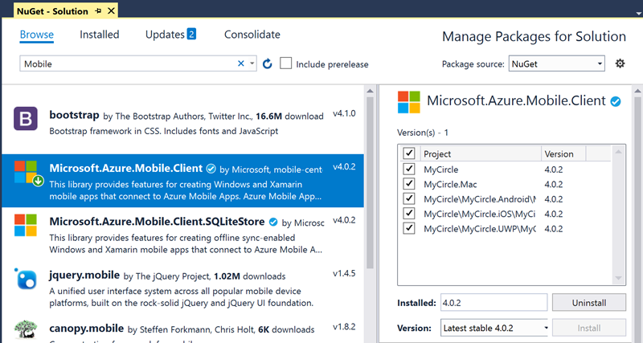

### Examine the IAsyncMessageRepository interface

1. The message repository is currently local and defined by the interface `IAsyncMessageRepository`. Locate that source file in the **MyCircle** shared-code project and open it.

2. The interface looks like this. Notice that all the methods are asynchronous and return `Task`s. Since the app is going to be talking to a network-based DB in the cloud, this sort of interface makes perfect sense.

```csharp
public interface IAsyncMessageRepository
{
    Task AddAsync(CircleMessage message);
    Task<IEnumerable<CircleMessage>> GetRootsAsync();
    Task<long> GetDetailCountAsync(string id);
    Task<IEnumerable<CircleMessage>> GetDetailsAsync(string id);
}
```

| Method | Purpose |
|--------|---------|
| `AddAsync` | Add a new `CircleMessage` to the database. |
| `GetRootsAsync` | Retrieve all root (main) conversations - these are the ones added on the Main screen and they might, or might not have children. |
| `GetDetailCountAsync` | Return the number of _child_ messages associated with the specified root message id. |
| `GetDetailsAsync` | Returns all the child messages (threads) for the given root message id. |

> **Note:** If you like, you can look at a concrete implementation of this interface which manages an in-memory collection of `CircleMessages` in the **Services/InMemoryRepository.cs** file.

### Add a new AzureMessageRepository class

1. Add a new C# class into the **Services** folder. Name it **AzureMessageRepository.cs**

2. Make the class `public` and `sealed`. There is no need to have anything derive from the class and this can provide a (small) performance benefit when accessing the interface methods since the compiler knows there's no virtual dispatch required.

### Add support for Azure

This is where the meat of the Azure connectivity will be added. You will create a `MobileServiceClient` object which will give the app access to the Azure service. This is really just a thin wrapper around `HttpClient` and it uses HTTP and REST protocols to work with the server-side code.

Each `TableController` created on the server is mapped to a `IMobileServiceTable<T>` which lets the app perform CRUD operations on the server table.

1. Add a `string` constant to the class to define where the Azure service is located. Name it **AzureServiceUrl** and set the value to be the Azure service URL:

```csharp
const string AzureServiceUrl = "https://build2018mycircle.azurewebsites.net";
```

2. Add a private field of type `Microsoft.WindowsAzure.MobileServices.MobileServiceClient` and name it **client**. This is the client accessor class to the Azure service.

3. Add a private field of type `Microsoft.WindowsAzure.MobileServices.IMobileServiceTable<CircleMessage>` and name it messages. This will hold the retrieved messages from Azure.

4. Add a public, default (no-argument) constructor to the class.

5. In the constructor, create a new `MobileServiceClient`, passing it your `AzureServiceUrl` and assign it to the **client** field.

6. After the **client** creation, call the method `GetTable<CircleMessage>()` to retrieve the server-side representation of `CircleMessages` from Azure and assign the result to the **messages** field.

```csharp
public sealed class AzureMessageRepository
{
    const string AzureServiceUrl = "https://build2018mycircle.azurewebsites.net";

    MobileServiceClient client;
    IMobileServiceTable<CircleMessage> messages;

    public AzureMessageRepository()
    {
        client = new MobileServiceClient(AzureServiceUrl);
        messages = client.GetTable<CircleMessage>();
    }
}
```

### Implement IAsyncMessageRepository

1. Have the class implement the `IAsyncMessageRepository` interface. You can use the built-in refactoring support to provide stubbed out implementations for the required methods or type them all yourself using the [interface definition above](#examine-the-iasyncmessagerepository-interface).

All the methods will be implemented using the **messages** `IMobileServiceTable<CircleMessage>` field.

### Implement the Add method

1. Use `InsertAsync` on the **messages** field to add the passed `CircleMessage`. 

```csharp
public Task AddAsync(CircleMessage message)
{
    return messages.InsertAsync(message);
}
```

### Implement GetRootsAsync

The `IMobileServiceTable` interface supports some basic LINQ capabilities which are turned into OData `$filter` queries that are executed on the server side. You can use these to filter the data so Azure is only returning the specific data needed vs. the entire table every time.

1. Use LINQ to add a `Where` clause that only looks for root messages (`IsRoot == true`), and where the returned data is in descending order on the `CreatedDate` property.

2. Use the extension method `ToEnumerableAsync` to execute the query on the server and return the results. You can use `async` and `await` to make the code easy to work with as shown below.

```csharp
public async Task<IEnumerable<CircleMessage>> GetRootsAsync()
{
    return await messages.Where(cm => cm.IsRoot)
        .OrderByDescending(cm => cm.CreatedDate)
        .ToEnumerableAsync();
}
```

### Implement GetDetailsAsync

1. You can implement `GetDetailsAsync` in the same way - except the `Where` clause should look for all `ThreadId` properties matching the passed **id** parameter.

2. It should be ordered by the `CreatedDate` property in _ascending_ order.

3. Use the same `ToEnumerableAsync` extension method to execute the query and return the `Task` with results.

### Implement GetDetailCountAsync

1. Use the same basic query you created for `GetDetailsAsync`, except add a test to the `Where` clause to exclude root messages so the result only contains the children (`IsRoot == false`).

2. Before calling `ToEnumerableAsync`, add a call to `IncludeTotalCount` into the fluent calls - this will return the total count of matching objects.

3. Call `ToEnumerableAsync` and cast the result to `IQueryResultEnumerable<CircleMessage>` - this has a `TotalCount` property you can return from the method.

4. An optimization you can make here is to append `ConfigureAwait(false)` to the fluent calls so it stays on the worker thread vs. coming back to the UI thread on the `await` call. This is optional but shown below.

```csharp
public async Task<long> GetDetailCountAsync(string id)
{
    var result = await messages
                   .Where(cm => cm.ThreadId == id && !cm.IsRoot)
                   .IncludeTotalCount().ToEnumerableAsync()
                   .ConfigureAwait(false) as IQueryResultEnumerable<CircleMessage>;
    return result.TotalCount;
}
```

### Replace the created repository

1. Open the **App.xaml.cs** file in the **MyCircle** shared-code project.

2. Locate the static property holding the `IAsyncMessageRepository` instance.

3. Replace the implementation with a new `AzureMessageRepository`.

```csharp
public static IAsyncMessageRepository Repository = new AzureMessageRepository();
```

4. Build the solution and cleanup any compilation errors.

### Update the data model

If you run the app now, it will have a runtime failure. The `CircleMessage` definition doesn't _quite_ match the server implementation. There are two things that need to change:

1. The server should be assigning the primary key (`Id`) and creation date. Currently, the code is doing that in the `CircleMessage` constructor. That code needs to be removed.

2. The server uses the name `CreatedAt` to hold the creation date as a `DateTimeOffset?` - this is a _hardcoded_ field in Azure and the client must conform either by changing the property name, or applying a `JsonProperty` attribute to change the network representation.

3. Make the necessary changes - make sure to use the built-in class rename feature to rename the `CreatedDate` field to `CreatedAt` - so you catch all usages. In addition, make sure to change the field type from `DateTime` to `DateTimeOffset?`.

Here's the correct definition of the `CircleMessage`:

```csharp
public class CircleMessage
{
    ...
    public DateTimeOffset? CreatedAt { get; set; }

    ...
    public CircleMessage(string parentId = null)
    {
        ThreadId = parentId ?? Guid.NewGuid().ToString();
    }
```

### Run the app

1. Run the application on your platform of choice. You should no longer see the test data, but should now be seeing data from the cloud.

2. If you insert a message, other copies of the app should be able to refresh and see your messages!

> **Note** Given that this is a shared data source, be family friendly please!

3. You can respond to messages.

4. If you close the app and reopen it, you should still see your messages.

## Part 2: Add Speech Services

Now that the app is talking to Azure, let's use another Azure service to give some more features to the app - translating speech into text.

You will be using two NuGet based plug-ins for this:

1. [Xam.Plugin.SimpleAudioRecorder](https://www.nuget.org/packages/Xam.Plugin.SimpleAudioRecorder/) to record audio on the device in a cross-platform fashion. The code is open source and you can check out the implementation [here](https://github.com/adrianstevens/Xamarin-Plugins).

2. [Plugin.SpeechToText](https://www.nuget.org/packages/Plugin.SpeechToText/) to call Azure and translate the recorded speech to text using the [Bing Speech API](https://azure.microsoft.com/en-us/services/cognitive-services/speech/). Note that while the Azure service supports multiple languages, this specific implementation only works for spoken English.

The lab uses this NuGet package for convenience since it's mostly boiler plate code, but it's useful to look at the technique used. 

You will need a Bing Speech to Text API key which can be obtained using [these instructions](#get-an-api-key), but once you have that, if you want to just jump adding the speech support to the app, you can [skip directly to that step](#add-recording-support-to-the-ui).

### Working with Bing Speech to Text service

The Bing Speech to Text service is a REST-based web service that takes a media stream, passed in the body of the request, and returns the textual representation of the spoken words.

There is a .NET SDK which can be used for desktop applications, however it relies on some C++ code which makes it non-portable to mobile platforms.

There is also a .NET-based service library - but this is intended only for server-side use as it allows for long-authenticated requests.

Mobile apps are recommended to use the REST service directly which is located at https://speech.platform.bing.com/speech/recognition/.

There are two steps involved in translating a media file.

1. Get an authentication token.
2. Submit a translation request.

#### Get an API key

All the cognitive services (vision, speech, search, etc.) use shared API keys ("secrets") to validate access to the service. You must request a key in order to gain access to each service you want to use.

There are two ways to get an API key. You can get the Free/Trial key which allows for 5k transactions at 20/minute. Or you can tie the key to an Azure subscription for higher load.

You can use the free/trial key, or log into the [Azure Portal](https://portal.azure.com) to request a subscription-based key.

1. Open a browser and go to https://azure.microsoft.com/en-us/try/cognitive-services/

2. Select **Speech** as the API.

3. Click **Get API Key** on the Bing Speech API entry.

4. Agree to the terms and login to a Microsoft account to assign the free key.

5. It will then take you to the Cognitive Services API page, scroll down to find the **Bing Speech API**. It will contain two API keys (primary/secondary). Copy down the primary key.

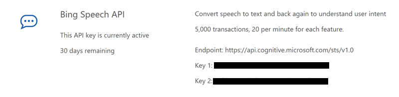

#### Authenticate to the Cognitive service API

The Bing Speech to Text REST API uses an authentication endpoint located at https://api.cognitive.microsoft.com/sts/v1.0/issueToken to issue temporary access tokens valid for 10 minutes. 

You get a token by calling the authentication endpoint, passing the API key as a header value for the `Ocp-Apim-Subscription-Key` key. The returned data will either be an error, or a valid authentication token to access the service - valid for 10 minutes.

Here's an example of getting the access token given the API key obtained from the Azure portal:

```csharp
private async Task<string> GetAuthenticationToken(string apiKey)
{
    HttpClient client = new HttpClient();
    httpClient.DefaultRequestHeaders.Add(
        "Ocp-Apim-Subscription-Key", apiKey);

    var uriBuilder = new UriBuilder("https://api.cognitive.microsoft.com/sts/v1.0/issueToken");

    var result = await httpClient.PostAsync(
        uriBuilder.Uri.AbsoluteUri, null);
    return await result.Content.ReadAsStringAsync();
}
```

#### Translating Speech to Text

The Speech to Text API takes a **WAV** formatted file (only PCM Mono 16k encoding is supported) and translates it to a string.

You send a `POST` request to https://speech.platform.bing.com/speech/recognition/dictation/cognitiveservices/v1 with a few query string parameters to indicate the format and language to expect.

The request will be denied unless a valid bearer access token (obtained above) is passed in the HTTP Authorization header.

The API returns a JSON object with the following format (**Note**: the code is using a JSON.net attribute to make sure the network name for the object is **result** instead of the default which would match the class name):

```csharp
[JsonObject("result")]
public class SpeechToTextResult
{
    public string RecognitionStatus { get; set; }
    public string DisplayText { get; set; }
    public string Offset { get; set; }
    public string Duration { get; set; }
}
```

Here's a simple example of calling the REST API to translate a **.wav** file passed in as a `Stream` along with an auth token obtained using the code above.

```csharp
private async Task<SpeechToTextResult> SendRequestAsync(Stream mediaStream, string authToken)
{
    string url = "https://speech.platform.bing.com/speech/recognition/dictation/cognitiveservices/v1" + 
        "?language=en-us&format=simple";

    var client = new HttpClient();
    client.DefaultRequestHeaders.Authorization = 
    new AuthenticationHeaderValue("Bearer", authToken);

    // Define the media we want to translate.
    var content = new StreamContent(mediaStream);
    content.Headers.TryAddWithoutValidation(
        "Content-Type", 
        "audio/wav; codec=\audio/pcm\"; samplerate=16000");

    var response = await httpClient.PostAsync(url, content);
    var jsonText = await response.Content.ReadAsStringAsync();

    return JsonConvert.DeserializeObject<SpeechToTextResult>(jsonText);
}
```

You can then get the text from the `DisplayText` property of the returning object.

### Add recording support to the UI

1. Open the `MessagesView.xaml` UI definition.

2. Scroll to the bottom and locate the `Entry` with the name `messageEntry`. The goal is to place an icon next to this field.

3. Surround the `Entry` in a `Grid`.

```xml
...
    <Grid>
        <Entry x:Name="messageEntry" ... />
    </Grid>
</StackLayout>
```

4. Move the `FlexLayout.Shrink` property off the `Entry` and add it to the new `Grid`.

5. Add three columns to the `Grid`:
	- Star-sized (the default)
	- 48 units
	- 10 units

```xml
<Grid FlexLayout.Shrink="0" Margin="20">
    <Grid.ColumnDefinitions>
        <ColumnDefinition />
        <ColumnDefinition Width="48" />
        <ColumnDefinition Width="10" />
    </Grid.ColumnDefinitions>
    ...
</Grid>
```

6. Add an `Image` after the `Entry` (inside the `Grid`).
	- Set the `Source` property to "speech.png". This icon is already present in the platform-specific projects.
	- Set the `Grid.Column` property to "1".
    - Set the `VerticalOptions` property to "Center".
    - Set the `Aspect` property to "AspectFit".

7. Add a `TapGestureRecognizer` to the `Image` in it's `GestureRecognizers` collection. Set the `Tapped` event to "OnTranslateSpeechToText". This method already exists, the lab will look at it next.

```xml
<Image Source="speech.png" Grid.Column="1" VerticalOptions="Center" Aspect="AspectFit">
    <Image.GestureRecognizers>
        <TapGestureRecognizer Tapped="OnTranslateSpeechToText" />
    </Image.GestureRecognizers>
</Image>
```

8. To make it more visually striking, set the `BackgroundColor` for the `Grid` to be **"Accent"** and set the `Padding` to **"5"**.

```xml
<Grid FlexLayout.Shrink="0" BackgroundColor="Accent" Padding="5">
...
```

9. Next, since the background will now be a color, add the following elements to the `Entry` - this will change the Text Color on Android to be White since it doesn't render a background like the other platforms do. You can copy this code from the **LoginPage.xaml** `Entry` control if you want, or grab it below - you want the setter for `Entry.TextColor` and `Entry.PlaceholderColor`.

```xml
<Entry ...>
    <Entry.TextColor>
        <OnPlatform x:TypeArguments="Color">
            <OnPlatform.Platforms>
                <On Platform="Android" Value="White" />
            </OnPlatform.Platforms>
        </OnPlatform>
    </Entry.TextColor>
    <Entry.PlaceholderColor>
        <OnPlatform x:TypeArguments="Color">
            <OnPlatform.Platforms>
                <On Platform="Android" Value="White" />
            </OnPlatform.Platforms>
        </OnPlatform>
    </Entry.PlaceholderColor>
</Entry>
```

### Add recording behavior to the UI

1. Open the **MessagesView.xaml.cs** C# file.

2. At the bottom of the class, locate the `OnTranslateSpeechToText` method and examine it's implementation.

```csharp
private async void OnTranslateSpeechToText(object sender, EventArgs e)
{
    if (!messageEntry.IsEnabled) return;

    var vm = new SpeechTranslatorViewModel(async s => {
        if (!string.IsNullOrWhiteSpace(s))
        {
            messageEntry.Text = s;
        }
        await Navigation.PopModalAsync();
    });

    await Navigation.PushModalAsync(new SpeechTranslatorPage() { BindingContext = vm });
    await vm.StartRecording().ConfigureAwait(false);
}
```

- It checks to see if the UI is currently busy refreshing (the `Entry` field is disabled in this case).
- It creates a new `SpeechTranslatorViewModel` to handle the speech translation event.
- It passes a delegate to the view model - this is called when the translation is finished or fails. In either case, it navigates backwards to destroy the **SpeechTranslatorPage**.
- Finally, it navigates to the **SpeechTranslatorPage** and sets the binding context to be the newly created VM.
- Once the navigation is complete, it starts recording by calling the `StartRecording` method on the ViewModel. This method has no implementation currently, so let's fix that.

### Test the Recording UI

1. Run the app on one of the supported platforms.

2. On the main and details screen, you should see a new microphone icon next to the "Enter Message" entry.

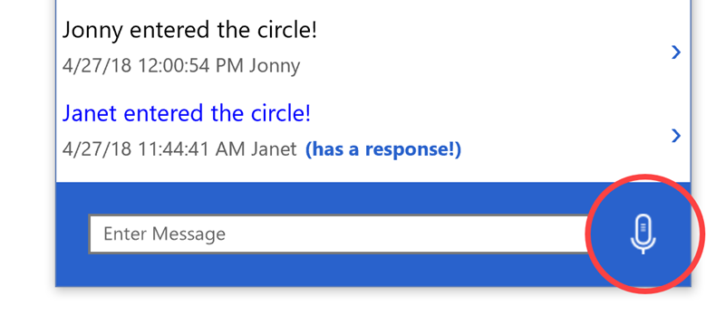

3. Tapping on the icon will present a new screen we've not seen before.

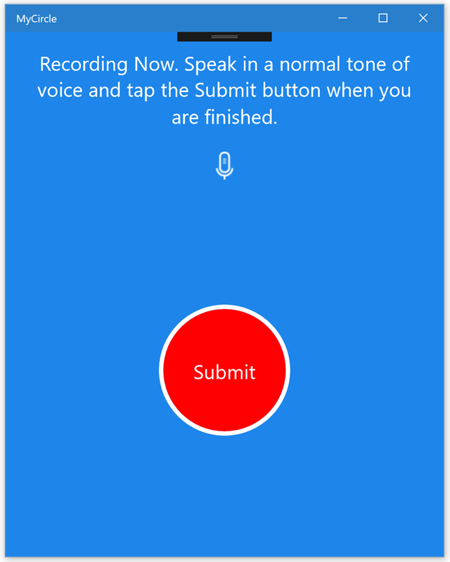

4. Tapping on the **Submit** button will stop the recording and submit it to Azure for translation. Then the screen will automatically go back to where you started - filling in the `Entry` with your translated text.

Currently, the behavior is mocked out in the **SpeechTranslatorViewModel** file, let's add in the real support.

### Add the required NuGet packages

1. Open the NuGet manager for the solution (or per-project if you are using Visual Studio for Mac).

2. Check the **Include prerelease** checkbox.

3. Add a reference to **Xam.Plugin.SimpleAudioRecorder** to all the projects.

4. Add a reference to **Plugin.SpeechToText** to all the projects.

### Add code to start recording

1. Expand the **ViewModels** folder in the **MyCircle** shared-code project in the Solution Explorer.

2. Locate the **SpeechTranslatorViewModel.cs** file and open it.

3. In the source file, locate the `StartRecording` method.

4. Just above the method, add a new field of type `Plugin.SimpleAudioRecorder.ISimpleAudioRecorder` named **recorder**.

5. In the `StartRecording` method, create a new recorder object by calling the static `CrossSimpleAudioRecorder.CreateSimpleAudioRecorder()` method. Assign the return value to the **recorder** field.

6. Check the `CanRecordAudio` property on the **recorder** object to see if the device has recording capabilities.

7. If so, call the `RecordAsync` method. Since it returns a `Task`, use the `await` keyword to properly wait on the result.

8. If recording is not possible, call the **finishedCallback** delegate and pass a `null` value - as you saw earlier in the implementation for `OnTranslateSpeechToText`, this will cancel the recording in the UI and return you to the main screen.

```csharp
ISimpleAudioRecorder recorder;

public async Task StartRecording()
{
    recorder = CrossSimpleAudioRecorder.CreateSimpleAudioRecorder();
    if (recorder.CanRecordAudio)
    {
        await recorder.RecordAsync().ConfigureAwait(false);
    }
    else
    {
        finishedCallback(null);
    }
}
```

### Add code to stop recording

1. In the **SpeechTranslatorViewModel.cs** file, find the `OnStopRecording` method. This is called when the **STOP** button is tapped in the UI.

2. Remove the `Task.Delay(2500);` line and replace it with a call to `StopAsync` on the **recorder** field. Cache off the result in a local variable named **recorderResult**.

```csharp
private async Task OnStopRecording()
{
    IsTranslating = true;

    // TODO: stop recording
    var recorderResult = await recorder.StopAsync();
    ...
}
```

3. Instantiate a new `Plugin.SpeechToText.SpeechToText` object, passing it your [Speech API key](#get-an-api-key). Use the `await` keyword and name the resulting object **speechClient**.

4. Remove the dummy string result (**text**).

5. Call the `RecognizeSpeechAsync` method on the **speechClient** object - this takes the media file which is available from the **recorderResult.GetFilePath()** method.

6. Save the result from the `RecognizeSpeechAsync` call into a local variable named **speechResult**. Apply the `await` keyword to easily retrieve the task-based return value.

```csharp
// TODO: submit text to Azure
var speechClient = new SpeechToText(SpeechApiKey);
var speechResult = await speechClient.RecognizeSpeechAsync(
                         recorderResult.GetFilePath());
```

7. Pass the `speechResult.DisplayText` property to the **finishedCallback** delegate to close the screen and finish the recording/translation.

8. Run the app on one of the available platforms. Try going through the recording screens. 

> What happened? Do you have any guesses why it doesn't work? 

### Request permission to use the microphone

It would be a huge privacy issue if your devices could record you indiscriminately without your knowledge. That's why the recording code isn't working yet - it either fails at runtime, or gets ignored by the platform.

You will need to do two things:

1. Add a permissions declaration into the app. This is a notification that the app _might_ use the given requested feature.

2. Request to use the microphone at runtime. This is an active UI request informing the user that we'd like to record them. For most platforms, the user has to explicitly allow this the first time and they can, in most cases, remove permissions later on through system settings on the device.

Unfortunately, each platform has slightly different requirements. So you need to go through each project to add the metadata to request permissions to the microphone, and then add a NuGet package to easily _request_ the user's permission at runtime in a cross-platform way.

#### Android

1. Open the project properties for the **MyCircle.Android** project. 

2. In the GUI, select the **Android Manifest** section.

3. Locate the **Required Permissions** section of the page.

4. Check the following permissions in the dialog. Note you can _search_ for a permission through the edit field above the list.
	- RECORD_AUDIO
	- READ_EXTERNAL_STORAGE
	- MODIFY_AUDIO_SETTINGS
	- WRITE_EXTERNAL_STORAGE

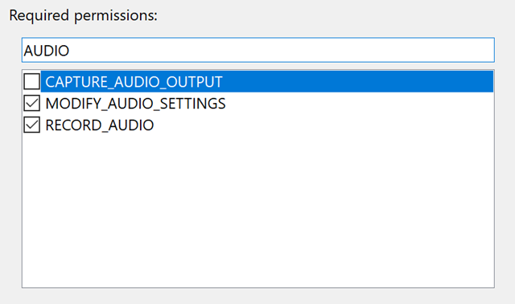


#### iOS

1. Expand the **MyCircle.iOS** project in the Solution Explorer.

2. Locate the **info.plist** file in the project.

3. Right-click on the file and select **Open With...** and select **XML (Text) Editor** from the dialog.

4. Go to the bottom of the file, right before the closing `</dict>` tag, add the following two lines to request microphone usage:

```xml
<key>NSMicrophoneUsageDescription</key>
<string>Record my voice for Speech to Text</string>
```

#### macOS

No steps are necessary for macOS since it's a desktop application, it has full access to the microphone without any declarations.

#### UWP

1. Expand the **MyCircle.UWP** project in the Solution Explorer.

2. Locate the **package.appxmanifest** file and double-click on it to open it in the editor.

3. Switch to the **Capabilities** tab.

4. Locate the **Microphone** capability and make sure it's checked.

#### Request user permission at runtime

The last step is to request user permissions from the platforms that require it (iOS and Android). The lab will do this using another NuGet package that makes this a bit easier.

1. Add the NuGet package [Plugin.Permissions](https://www.nuget.org/packages/Plugin.Permissions/) to all the projects.

2. Expand the **MyCircle.Android** project in the Solution Explorer.

3. Add the following code into the `MainActivity` class:

```csharp
using Plugin.Permissions;

...

public override void OnRequestPermissionsResult(
        int requestCode, string[] permissions, 
        [GeneratedEnum] Android.Content.PM.Permission[] grantResults)
{
    base.OnRequestPermissionsResult(requestCode, permissions, grantResults);
    PermissionsImplementation.Current.OnRequestPermissionsResult(requestCode, permissions, grantResults);
}
```

4. Next, locate the `OnCreate` override in the class and add the following line just before the call to `Forms.Init`:

```csharp
using Plugin.CurrentActivity;

public class MainActivity : ...
{
   protected override void OnCreate(Bundle bundle)
   {
      ...
      base.OnCreate(bundle);
      CrossCurrentActivity.Current.Activity = this;
      ...
  }
}
```

5. Finally, switch back to the **SpeechTranslatorViewModel.cs** file in the **MyCircle** project and add the following method to the class:

```csharp
using Plugin.Permissions;
using Plugin.Permissions.Abstractions;

...

private async Task<bool> RequestAudioPermissions()
{
    if (Device.RuntimePlatform == Device.macOS)
        return true;

    PermissionStatus status = PermissionStatus.Unknown;

    try
    {
        status = await CrossPermissions.Current.CheckPermissionStatusAsync(Permission.Microphone);
        if (status != PermissionStatus.Granted)
        {
            if (await CrossPermissions.Current.ShouldShowRequestPermissionRationaleAsync(Permission.Microphone))
            {
                var results = await CrossPermissions.Current.RequestPermissionsAsync(Permission.Microphone);
                if (results.ContainsKey(Permission.Microphone))
                    status = results[Permission.Microphone];
            }
        }
    }
    catch
    {
    }

    return status == PermissionStatus.Granted;
}
```

6. Locate the `StartRecording` method you worked on earlier and add a call to request audio permissions as the first step in the method. If it returns `false`, invoke the **finishedCallback** with a `null` parameter to close the recording UI since the user denied the request.

```csharp
public async Task StartRecording()
{
    if (!await RequestAudioPermissions())
    {
        finishedCallback(null);
        return;
    }
    ...
}
```

### Run the app

1. Run the application on one of the supported plaforms.

2. Tap the microphone icon to begin recording.

3. Say something in English.

4. Tap the **Submit** button to send the speech to Azure.

5. See the results in the `Entry`.

## Part 3: Add Offline sync

As a final step lets solve a common issue with mobile device - lack of network reliability and/or connectivity.

The lab will do this by adding support for a local cache of the `CircleMessages` that the app can work with in a disconnected fashion. This means it will also need to synchronize any changes made locally back to the cloud storage once network connectivity is restored.

Lucky for us, this is a built in feature of the Azure App Mobile App Service platform being used!

### Add the required NuGet package

1. Using the NuGet package manager UI, add the [Microsoft.Azure.Mobile.Client.SQLiteStore](https://www.nuget.org/packages/Microsoft.Azure.Mobile.Client.SQLiteStore/) package to all projects.

This package also includes a dependency against SQLite which is supported by all the platforms - however, for UWP you will need to add one more runtime requirement: the Visual C++ 2015 runtime.

2. Expand the **MyCircle.UWP** project in the Solution Explorer.

3. Right click on the **References** folder and select **Add Reference...**.

4. Select **Universal Windows > Extensions** in the dialog left-hand pane.

5. Add a checkmark next to the **Visual C++ 2015 Runtime for Universal Windows** entry.

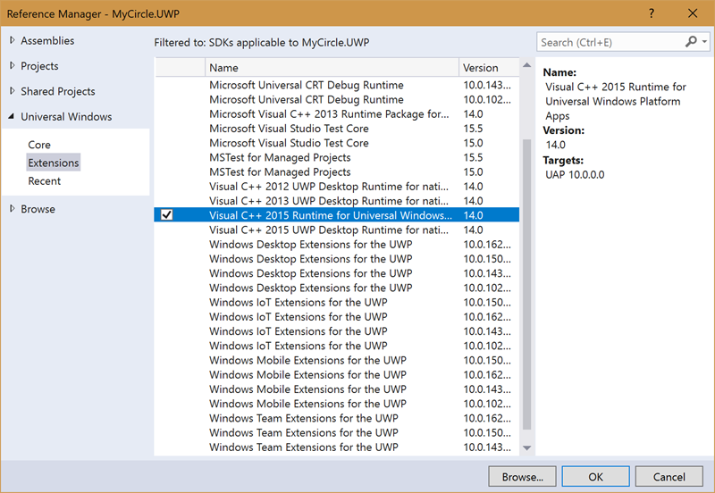

### Add the SQLite initialization code for macOS

macOS requires a method call _before_ you can use SQLite.

1. Open **Main.cs** and locate the `Main` method.
2. At the start of the method, add the following line of code to initialize SQLite.

```
static void Main(string[] args)
{
    SQLitePCL.Batteries_V2.Init();
    ...
}
```

### Initialize the offline cache

Support for offline caching is provided through SQLite, but it requires us to initialize the library a bit differently, and to use a different table interface implementation: `IMobileServiceSyncTable<T>`.

1. Open the **Services/AzureMessageRepository.cs** file in the **MyCircle** shared-code project.

2. Remove the call to `GetTable<CircleMessage>` in the constructor.

3. Change the `IMobileServiceTable<CircleMessage>` **messages** field to be a `IMobileServiceSyncTable<CircleMessage>` instead. This is the interface which supports offline synchronization.

```csharp
public sealed class AzureMessageRepository ...
{
    ...
    IMobileServiceSyncTable<CircleMessage> messages;

    public AzureMessageRepository()
    {
        client = new MobileServiceClient(AzureServiceUrl);
    }
    ...
}
```

4. Add a new method to the class named `InitalizeTableAsync` which returns a `Task` and takes no parameters. The code will be using the `await` keyword in this method, so go ahead and apply the `async` keyword to the signature.

5. In the method, check whether **messages** has been initialized by checking to see if it's `null`.

```csharp
private async Task InitializeTableAsync()
{
    if (messages == null)
    {
        // Need to init
    }
}
```

6. If `null`, the code will need to do some one-time initialization (per launch). First, create a new local variable in the method of type `MobileServiceSQLiteStore`. Store it in a variable named **store** and pass it a filename - the instructions here will use "offlinecache.db".

```csharp
var store = new MobileServiceSQLiteStore("offlinecache.db");
```

7. Next, call `DefineTable<CircleMessage>()` on the **store** object to define the shape of the offline table from the model object.

```csharp
store.DefineTable<CircleMessage>();
```

8. Call `client.SyncContext.InitializeStore` passing the **store** object - this will initialize the offline support through an intermediary built-in class named the "SyncContext".

```csharp
await client.SyncContext.InitializeAsync(store);
```

9. Finally, call `GetSyncTable<CircleMessage>` on the **client** field to retrieve the new synchronization table and assign it to the **messages** field.

```csharp
messages = client.GetSyncTable<CircleMessage>();
```

### Ensure the offline table is initialized

1. Go through all the public methods in the `AzureMessageRepository` class and make sure `InitializeTableAsync` is called before trying to work with the **messages** field.  

> **Note**: You could also make the method public and force the client user to call it before using the class. Or even short circuit the code by checking `messages` before calling it to make it a little more efficient and avoid the call. 

2. As an example, here is the adjusted `AddAsync` method:

```csharp
public async Task AddAsync(CircleMessage message)
{
    await InitializeTableAsync();
    await messages.InsertAsync(message);
}
```

> Another option, which the solution in Github will take is to only call it on `AddAsync` and `GetRootsAsync` which is always called first. The detail-oriented methods require an existing message with an **Id** which shouldn't be possible to retrieve without calling one of the other methods first. Instead, the lab uses a `Debug.Assert`. You can see the [completed code here](https://github.com/XamarinUniversity/build2018-labs/blob/master/lab2/part3/MyCircle/MyCircle/Services/AzureMessageRepository.cs#L60).

3. Run the app on one of the supported platforms - it should **crash** or fail because the offline synchronization requires that the `CircleMessage` has a default constructor!

#### Add a default constructor to CircleMessage

1. Open the **CircleMessage.cs** source file in the **Data** folder of the **MyCircle** shared-code project.

2. Locate the constructor - notice it takes a default parameter. Remove the default value and create a second version of the constructor that chains to this parameterized version:

```csharp
public CircleMessage() : this(null)
{
}

public CircleMessage(string parentId)
{
    ...
}
````

3. Run the app on one of the supported platforms - it should run now, but notice that it no longer shows any data! That's because the app hasn't actually _pulled_ the data down from Azure yet, that's now a manual operation which has to be deliberately invoked.

> With offline synchronization, you now have complete control over when the app gets updates from Azure, and when it pushes any local changes _back_ to Azure.

### Add support to pull remote changes from Azure

Pulling changes is done _incrementally_ by defining a unique query with an assigned name. When you ask for new changes, you use the same query and name, and the library _automatically_ fetches only changed records from the last time you did a pull from the server.

The first time, this will take some time - as all records are retrieve (in 50 count batches), but after that, it's quite fast unless the table has a lot of churn.


1. In the `AzureMessageRepository` class, add a new method named `PullChangesAsync`. It should return a `Task` and take no parameters. Go ahead and add the `async` keyword to the signature.

2. On the **messages** field, call `PullAsync`, you need to pass it two parameters:
	- **query name**: a unique string to represent the shape of the data being retrieved. If your app pulls different aspects of the data, you can have different caches by specifying different query names. In addition, you can pass `null` as the query name to force a full fetch.
	- **query**: the actual query to retrieve - this includes any `Where` and `Select` constraints. You can just use the built-in `CreateQuery` method on the `IMobileServiceSyncTable` interface to do a standard `SELECT` with all fields.

3. You can use any unique string for the query name - the lab will use "sync_CircleMessage" here.

4. Use the default `CreateQuery` on your **messages** field to generate the query. It should return all records (roots and details) since the app will be using them all at some point and it's far more efficient to bundle as much data in one round-trip as possible.

3. Add a `ConfigureAwait(false)` at the end of the method chain - since the app isn't doing anything in the method that requires the UI thread, you can make it more efficient by not forcing it switch back when the pull is complete.


```csharp
private async Task PullChangesAsync()
{
    await messages.PullAsync($"sync_{nameof(CircleMessage)}", 
                             messages.CreateQuery())
        .ConfigureAwait(false);
}
```

> **Why not have two queries: one for Roots and one for Details?**
>
> You could certainly do that - and if some of the data was never referenced, or rarely used it might make sense and be more efficient. However, always remember to balance the amount of data with the number of round trips to the server. Each query does at _least_ two queries to ensure it got all the data as it pages in 50 record increments under the covers to improve responsiveness.
>
> In addition, maintaining multiple caches can get confusing and cause some data discrepancies - it complicates the design of the app and how it manages the data (e.g. think about updates to one cache but not pulling down the other).
> 
> So the team opted for simplicity here - as most apps should probably do. You can play with this design however and watch the network traffic with a tool like [Fiddler](https://www.telerik.com/fiddler) on the UWP version of the app to watch the traffic.

### Use the new support to pull data down

1. Update the `GetRootsAsync` and `GetDetailsAsync` method to use the new `PullChangesAsync` to grab the latest copy of server-side data. Make sure you call this _after_ you initialize the table, but _before_ you do the actual query.

> The cool thing here is that your queries to **messages** will all be done from the local cache now - that's why you didn't see any data before the app pulled it down!

2. Here's `GetRootsAsync` as an example:

```csharp
public async Task<IEnumerable<CircleMessage>> GetRootsAsync()
{
    await InitializeTableAsync();
    await PullChangesAsync();

    return await messages.Where(cm => cm.IsRoot)
        .OrderByDescending(cm => cm.CreatedAt)
        .ToEnumerableAsync();
}
```

3. Try running the app now - you should see data again, however inserting new records won't work yet because the app isn't pushing the local changes back to Azure.

### Add support to push local changes to Azure

1. In the `AzureMessageRepository` class, add a new method named `PushChangesAsync`. It should return a `Task` and take no parameters. Go ahead and add the `async` keyword to the signature.

2. Use the `SyncContext` property on the **client** field and call the `PushAsync` method. Since this is a `Task`-based method, use the `await` keyword to properly synchronize to it.

```csharp
private async Task PushChangesAsync()
{
    // Push queued changes back to Azure
    await client.SyncContext.PushAsync();
}
```

3. Run the app and try inserting a record, others should be able to see the record if they refresh, showing that it's synchronizing to Azure!

### Adding a network check

If you try turning off your network access, you will find things break down quickly - the client will throw an exception because no network is available. You could `catch` the exception and provide a nicer message, but a better approach is to avoid it by checking to see if the app has network connectivity and not attempt any synchronization in that case.

1. Open the NuGet package manager for the solution (or for each project on VS for Mac).

2. Add the [Xam.Plugin.Connectivity](https://www.nuget.org/packages/Xam.Plugin.Connectivity/) to all projects.

3. Add a new method to the `AzureMessageRepository` class named `IsOnlineAsync`. It should take no parameters and return a `Task<bool>`.

4. In the method, call the `CrossConnectivity.Current.IsRemoteReachable` method and pass it the Azure endpoint. 

5. You can use any timeout you prefer - the lab will use 5 seconds.

```csharp
private Task<bool> IsOnlineAsync()
{
    return CrossConnectivity.Current
        .IsRemoteReachable(client.MobileAppUri, 
            TimeSpan.FromSeconds(5));
}

```

6. Add a call to the new `IsOnlineAsync` method to your push and pull methods and exit early if you do not have network connectivity.

7. You can try the network failure case again if you like to see the new behavior - it should just silently hold onto things and then when connectivity is restored, it will push and pull changes.

> **Note**: you might be wondering if you need to _push_ changes after a connectivity restore. You could, however it turns out that the mobile service client will automatically push pending local changes as part of the next _pull_ which happens more often in the app.

### Handling conflicts (optional)

One of the things that can come up with data synchronization is _conflicts_. In this app, it's very unlikely because each instance just supports new records and the app doesn't do any delete or update operations.

However, it's useful to add the support just to complete the picture of working with offline data.

Conflict errors are reported when you call `PushAsync`. The client will throw a `MobileServicePushFailedException` exception with a collection of "push" failure records represented in a class named `MobileServiceTableOperationError` which gives us both the server and local record in conflict. 

For each record, you can take several actions:

- Force the server representation.
- Force the client representation.
- Merge the conflict in code.
- Ask the user what to do.

In this case, the lab will use the first two approaches. If the conflicted records are the same (as far as the app is concerned), then the app will use the server-side copy. If they are different, it will prefer the client side. This is a pretty common/simple approach to conflict resolution - but you can design and code any approach you prefer.

#### Add version support to the CircleMessage

You need to start by adding support to tracking versions in the model object. Luckily, this is actually built-in and is already present - the model just doesn't have a property mapping the field yet.

1. Open the **CircleMessage.cs** source file in the **Data** folder in the **MyCircle** shared-code project.

2. Add a new public property named `Version` of type `string`.

```csharp
public string Version { get; set; }
```

3. Next, to make it easy to compare two `CircleMessage` objects, let's implement `IEquatable<CircleMessage>` - add the interface to the class definition.

4. Implement the `Equals` method by comparing the `Id` property and all the app-specific properties.

```csharp
public bool Equals(CircleMessage other)
{
    return other.Id == this.Id
        && other.Text == this.Text
        && other.Color == this.Color
        && other.ThreadId == this.ThreadId;
}
```

#### Add conflict resolution to the view model

1. In the `AzureMessageRepository` class, add a new method named `ResolveConflictAsync` that returns a `Task` and takes a `MobileServiceTableOperationError` - name it **error**. 

2. Start by getting the server and local version and storing them in local variables. These are exposed through two generic properties on the passed `MobileServiceTableOperationError`:
	- **serverItem**: `Result.ToObject<CircleMessage>()`
	- **localItem**: `Item.ToObject<CircleMessage>()`

3. Next, compare the two objects - just use the new `Equals` method - it returns `true` if the two objects are semantically equal.

4. If they are equal, call `CancelAndDiscardItemAsync()` on the passed **error** object. You can return the `Task` from this method.

5. If they are not equal, update the **localItem.Version** property to be the value from the server object and call `UpdateOperationAsync` to push the local representation to the server. You can return the `Task` from this method.

6. You will need to turn the **localItem** into a JSON object - you can use `JObject.FromObject` to do this.

```csharp
private Task ResolveConflictAsync(MobileServiceTableOperationError error)
{
    var serverItem = error.Result.ToObject<CircleMessage>();
    var localItem = error.Item.ToObject<CircleMessage>();

    if (serverItem.Equals(localItem))
    {
        // Items are identical, ignore the conflict 
        // The server wins.
        return error.CancelAndDiscardItemAsync();
    }
    else
    {
        // otherwise, the client wins.
        localItem.Version = serverItem.Version;
        return error.UpdateOperationAsync(JObject.FromObject(localItem));
    }
}
```

7. Finally, wrap your `PushAsync` call in the `PushChangesAsync` method in a `try` / `catch` construct and catch the `MobileServicePushFailedException`.

8. In the `catch`, loop through all the `PushResult.Errors` if they exist (check for `null`), and call your new `ResolveConflictAsync` method to resolve each conflict.

```csharp
try
{
    // Push queued changes back to Azure
    await client.SyncContext.PushAsync();

}
catch (MobileServicePushFailedException ex)
{
    foreach (var error in ex.PushResult?.Errors)
    {
        await ResolveConflictAsync(error);
    }
}
```

9. Build and run the app one last time to make sure you haven't broken anything!

## Congratulations!

You have completed this lab exercise and gotten a taste of using a few Azure services to cloud-connect your Xamarin application.

There are a lot of other services you can consume from [AI and Machine Learning](https://azure.microsoft.com/en-us/services/cognitive-services/), to various [other storage](https://azure.microsoft.com/en-us/services/storage/) and [logic capabilities](https://azure.microsoft.com/en-us/services/functions/). Make sure to check out the [docs and samples](https://docs.microsoft.com/en-us/azure/) on all the services that might add more differentiators to your app!
